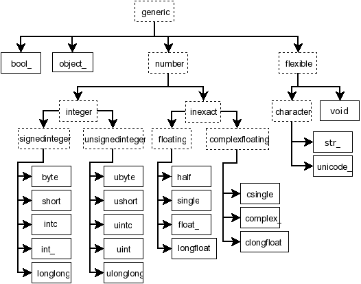

# NumPy

## Data Science 에서 다차원 배열의 필요성
```py
MathScore1 = 11
MathScore2 = 12
MathScore3 = 13
```
```py
MathScoreSum = MathScore1 + MathScore2 + MathScore3
MathScoreAverage = MathScoreSum/3

print("수학점수 합: {}".format(MathScoreSum))
print("수학점수 평균: {}".format(MathScoreAverage))
```

    만약 새로운 학생이 전학을 와서 시험을 쳤고 이 학생의 성적을 추가한 점수들의 합과 평균을 구하려면 어떻게 해야 할까요?

    새로운 변수를 추가해야 합니다.
```py
MathScoreSum = MathScore1 + MathScore2 + MathScore3 + MathScore4  # 추가된 MathScore4를 합 구할때 고려
MathScoreAverage = MathScoreSum/4                                 # 수정: 분모를 3에서 4로 수정

print("수학점수 합: {}".format(MathScoreSum))
print("수학점수 평균: {}".format(MathScoreAverage))
```
    그리고 합과 평균을 구하는 코드 역시 수정해야합니다.

### 해결방법
    리스트 자료형에 데이터를 저장하면 이 문제를 해결할 수 있습니다.

    다섯명의 학생들로 이루어진 반이 있고 이 학생들의 수학점수를 리스트에 저장하는 경우 아래처럼 처리할 수 있습니다.

```py
MathScoreList = [11, 12, 13]
listMathScoreSum = 0      # 변수 선언&초기화
listMathScoreAverage = 0  # 변수 선언&초기화

for e in MathScoreList:
  listMathScoreSum += e   # listMathScoreSum = listMathScoreSum + e 와 동일한 코드
  
listMathScoreAverage = listMathScoreSum / len(MathScoreList)

print("수학점수 합: {}".format(listMathScoreSum))
print("수학점수 평균: {}".format(listMathScoreAverage))
```

    만약 새로운 학생이 전학을 와서 시험을 쳤고 이 학생의 성적을 추가한 점수들의 합과 평균을 구하려면 어떻게 해야 할까요?

    기존의 리스트에 새로운 데이터를 추가하면 됩니다.
```py
# append: list의 끝에 요소를 추가할 때 사용하는 메서드
MathScoreList.append(14)  # 데이터 추가
```

## 파이썬 기본 자료형으로 구현한 다차원 배열

### Nested List (중첩 리스트)

    1반의 점수가 11, 12, 13

    2반의 점수가 21, 22, 23

    3반의 점수가 31, 32, 33점이라고 한다면,

    리스트 안에 리스트를 넣어 위 데이터를 아래처럼 나타낼 수 있습니다.

```py
MathScoreNestedList = [[11, 12, 13], [21, 22, 23], [31, 32, 33]]

print(MathScoreNestedList)

MathScoreNestedList2 = []

for list in MathScoreNestedList:
  tempList = []
  
  for e in list:
    tempList.append(e+1)
  
  MathScoreNestedList2.append(tempList)
  

print(MathScoreNestedList2)

```
    문제점
    1차원에서 2차원으로 데이터의 차원이 증가하니 반복문도 하나 더 사용해야 합니다.

    데이터의 차원이 증가할수록 코드는 복잡해질 수밖에 없습니다.

### NumPy로 구현한 다차원 배열

```py
import numpy as np

mathScoreNdarray = np.array(MathScoreNestedList)
# mathScoreNdarray = np.array([[11, 12, 13], [21, 22, 23], [31, 32, 33]])

print(mathScoreNdarray)
```
```
[[11 12 13]
 [21 22 23]
 [31 32 33]]
```
    각 원소에 1을 더하려면
```py
mathScoreNdarray + 1 # 이것이 바로 브로드캐스팅! 후반부에 다룰 예정입니다.

```
```
array([[12, 13, 14],
       [22, 23, 24],
       [32, 33, 34]])
```

```py
# 전체 합 구하기
np.sum(mathScoreNdarray)
# 198

# 열의 평균 구하기
np.average(mathScoreNdarray, axis=0)
# 22.0

# 행의 평균 구하기
np.average(mathScoreNdarray, axis=1)
# array([12., 22., 32.])

```
#### NumPy 장점

    코어 부분이 C로 구현되어 동일한 연산을 하더라도 Python에 비해 속도가 빠름
    라이브러리에 구현되어있는 함수들을 활용해 짧고 간결한 코드 작성 가능
    (효율적인 메모리 사용이 가능하도록 구현됨)


### stride

    -> 몇칸씩(몇 바이트) 건너뛰며 읽을것인지

    데이터는 하나의 순서로 저장해두고,
    Stride를 바꿔가며 Transpose 를 구현가능

    data : 1 2 3 4

    stride : (2,1)
    1   2
    3   4

    stride : (1,2)
    1   3
    2   4

    stride를 어떻게 주느냐에 따라 같은 데이터를 읽는 방법이 다름


## 다차원 배열 생성 1

    명시적으로 값을 입력해서 다차원 배열을 만들 수 있다



    다차원 배열의 원소는 위와 같은 데이터 타입을 가질 수 있습니다.

    Bool, Number, Object, Flexible

> 다차원 배열의 원소는 동일한 데이터 타입을 가져야 합니다.

    여러 타입의 데이터를 동시에 담을 수 없음

> np.array()를 사용해 다차원 배열을 생성할 수 있습니다.
```py
    boolArray = np.array([True, False, True, True, False])
    intArray = np.array([[1, 2], [3, 4]])
```

    정수형의 default data type은 'int64'입니다.

    (진실: default data type은 운영체제에 따라 다릅니다.)
```py
intArray = np.array([[1, 2], [3, 4]])
```
    부호없는 정수형의 default data type은 'uint64'입니다.
```py
uintArray = np.array([[1, 2], [3, 4]], dtype='uint')
```
    실수형의 default data type은 'float64'입니다.
```py
floatArray = np.array([[1.1, 2.2], [3.3, 4.4]])
floatArray2 = np.array([[1, 2], [3, 4]], dtype='float64')
floatArray3 = np.array([[1., 2.], [3., 4.]])
```
> 참고

    정수형에서 실수형으로의 형변환 과정은 데이터 손실이 일어나지 않아 문제될 부분이 없지만 반대의 경우에는 문제가 발생할 수 있습니다

```py
intArray2 = np.array([[1.1, 2.2], [3.3, 4.4]], dtype='int')
array([[1, 2],
       [3, 4]])
```

## 파일에서 데이터 입력받아 다차원 배열 생성하기
    np.genfromtxt()을 이용하여 파일에 저장된 데이터를 입력받아 다차원 배열을 생성할 수 있습니다.

    하지만 사용할 일은 많지 않습니다. 그 이유는,

    NumPy ndarray는 동일한 데이터타입만을 가질 수 있습니다.
    대부분 데이터 파일에는 하나의 데이터 타입만 있는게 아니라 정수, 실수, 문자열이 섞여 있습니다.
    파일에서 데이터를 읽어올땐 NumPy의 genfromtxt()보단 Pandas의 read_csv()나 read_excel()을 주로 사용합니다.

```py
fromCSVArray = np.genfromtxt('/content/drive/My Drive/resources/mnist_train_super_small.csv', delimiter=',')
```

## 다차원 배열 생성 2

    NumPy에 구현되어있는 함수를 활용해 다차원 배열을 만드는 방법

### numpy.empty

    Return a new array of given shape and type, without initializing entries.
    초기화되지 않음
```py
np.empty((2,3))
array([[2.7091738e-316, 0.0000000e+000, 0.0000000e+000],
       [0.0000000e+000, 0.0000000e+000, 0.0000000e+000]])
```
```py
A = np.array([[1, 2, 3], [4, 5, 6], [7, 8, 9]])
np.empty_like(A)
array([[            67418288, -8759219795938571396,   251086107548844119],
       [  899879404826789500,   899877162905767540,   534813880420173422],
       [  106960495671316333,    34904533496300388,   460501291080878442]])
```
    empty_like 함수는 넣어준 행렬과 같은 모양의 행렬을 초기화하지 않은체로 반환한다

### numpy.zeros
    Return a new array of given shape and type, filled with zeros.
```py
np.zeros((2, 3))
array([[0., 0., 0.],
       [0., 0., 0.]])

np.zeros((2, 3), dtype=int)
array([[0, 0, 0],
       [0, 0, 0]])
```
```py
np.zeros_like(A)
array([[0, 0, 0],
       [0, 0, 0],
       [0, 0, 0]])
```


### numpy.ones
    Return a new array of given shape and type, filled with ones.
```py
np.ones((2,3))
array([[1., 1., 1.],
       [1., 1., 1.]])

np.ones((2,3), dtype=int)
array([[1, 1, 1],
       [1, 1, 1]])
```
```py
np.ones_like(A)
array([[1, 1, 1],
       [1, 1, 1],
       [1, 1, 1]])
```
### numpy.identity
    Return the identity array.
```py
np.identity(3, dtype=int)
array([[1, 0, 0],
       [0, 1, 0],
       [0, 0, 1]])
```

### numpy.eye

    Return a 2-D array with ones on the diagonal and zeros elsewhere.

    파라메터를 주지 않으면 identity와 같음

```py
np.eye(3)
array([[1., 0., 0.],
       [0., 1., 0.],
       [0., 0., 1.]])

np.eye(3, 4)
array([[1., 0., 0., 0.],
       [0., 1., 0., 0.],
       [0., 0., 1., 0.]])

np.eye(3, 4, 1) # 대각선이 한칸 옆으로감
array([[0., 1., 0., 0.],
       [0., 0., 1., 0.],
       [0., 0., 0., 1.]])
```

### numpy.arange
    Return evenly spaced values within a given interval.
```py
# default value
# start = 0
# step = 1
np.arange(10)
array([0, 1, 2, 3, 4, 5, 6, 7, 8, 9])
```


## 다차원 배열 다루기 1

    통계값을 구하는 함수

    반복문을 사용하지 않는다

### numpy.amin

    Return the minimum of an array or minimum along an axis.

```py
A = np.array(   [[1, 2, 3],
                [4, 5, 6],
                [7, 8, 9]]  )

np.amin(A, 0)
# np.amin(A, axis=0)
array([1, 2, 3])


np.amin(A, 1)
# np.amin(A, axis=1)
array([1, 4, 7])


np.amin(A)
# 축을 정하지 않고, 모든 원소에 대해서
1
```

### numpy.median

    Compute the median along the specified axis.
    (중앙값 계산)
```py
A = np.array(   [[1, 2, 3],
                [4, 5, 6],
                [7, 8, 9]]  )

np.median(A, 0)
array([4., 5., 6.])

np.median(A, 1)
array([2., 5., 8.])

np.median(A)
5.0
```

### numpy.mean

    Compute the arithmetic mean along the specified axis. 
    (가중평균을 구하려면 numpy.average를 사용해야 합니다.)


## 다차원 배열 다루기 2

### 슬라이싱
    파이썬 리스트와 유사하게, Numpy 배열도 슬라이싱이 가능합니다.

    Numpy 배열은 다차원인 경우가 많기에, 각 차원별로 어떻게 슬라이스할건지 명확히 해야 합니다:

    Numpy 배열을 슬라이싱하면, 연속된 값을 가져오기에 결과로 얻어지는 배열은 언제나 원본 배열의 부분 배열입니다.

> a[행 슬라이싱 시작:행 슬라이싱 끝, 열 슬라이싱 시작:열 슬라이싱 끝]

```py
# shape가 (3, 4)인 2차원 배열 생성
# [[ 1  2  3  4]
#  [ 5  6  7  8]
#  [ 9 10 11 12]]
a = np.array([[1,2,3,4], [5,6,7,8], [9,10,11,12]])

a[0:2, 0:4] # 행은 0~1 까지, 열은 0~3까지(모두)
array([[1, 2, 3, 4],
       [5, 6, 7, 8]])

a[:2, :]    # 처음부터 2전까지, 전체
array([[1, 2, 3, 4],
       [5, 6, 7, 8]])

```
    위 코드는 열을 슬라이싱 하지 않는 코드이며 이런 경우 열 부분은 전체 생략 가능합니다.

    (행을 슬라이싱 하지 않는다고 하더라도, 행부분을 생략할 순 없습니다.)
```py
a[:2]
array([[1, 2, 3, 4],
       [5, 6, 7, 8]])
```

### 인덱싱
    
    인덱싱을 통해 원소에 접근할 수 있습니다.

    두 가지 표현법이 있습니다.
```py
a[0, 0] # better
a[0][0]
```

    Numpy 배열을 슬라이싱하면, 연속된 값을 가져오기에 결과로 얻어지는 배열은 언제나 원본 배열의 부분 배열입니다.

    그러나 인덱싱을 한다면, 연속하지 않은 값을 가져올 수 있으니 원본과 다른 배열을 만들 수 있습니다.
```py
array([[ 1,  2,  3,  4],
       [ 5,  6,  7,  8],
       [ 9, 10, 11, 12]])

# 0행, 2행만 인덱싱
a[[0, 2], ] # a[[0, 2], : ] 같은 코드
array([[ 1,  2,  3,  4],
       [ 9, 10, 11, 12]])

# 0열, 1열, 3열만 인덱싱
a[:, [0,1,3]]
array([[ 1,  2,  4],
       [ 5,  6,  8],
       [ 9, 10, 12]])
```

### 인덱싱&슬라이싱 - 차원

    정수 인덱싱과 슬라이싱을 혼합해서 사용하면 낮은 차원의 배열이 생성되지만,

    슬라이싱만 사용하면 원본 배열과 동일한 차원의 배열이 생성됩니다.

    0번째 행을 인덱싱하는 경우와 슬라이싱 하는 경우를 비교해보겠습니다.

```py
print(a, a.shape, a.ndim)
[[ 1  2  3  4]
 [ 5  6  7  8]
 [ 9 10 11 12]] (3, 4) 2
```
```py
# 슬라이싱만 사용
slicedRow = a[0:1, :]
print(slicedRow, slicedRow.shape, slicedRow.ndim)
[[1 2 3 4]] (1, 4) 2
```
```py
# 아래와 동일한 코드
# 인덱싱&슬라이싱 혼합 사용
indexedRow = a[0]
print(indexedRow, indexedRow.shape, indexedRow.ndim)
[1 2 3 4] (4,) 1

# 위와 동일한 코드
# 인덱싱&슬라이싱 혼합 사용
indexedRow2 = a[0, :]
print(indexedRow2, indexedRow2.shape, indexedRow2.ndim)
[1 2 3 4] (4,) 1
```
    인덱싱은 차원을 감소시키므로, 특별히 인덱싱을 써야 하는 상황이 아니라면, 인덱싱보다 슬라이싱을 추천합니다.

### 인덱싱&슬라이싱 - 값 복사&참조

    인덱싱은 "값"을 복사해옵니다. 복사된 값을 변경해도 원본의 값은 변하지 않습니다.


    슬라이싱된 배열은 원본 배열과 같은 데이터를 "참조"합니다.

    즉 슬라이싱된 배열을 수정하면 원본 배열 역시 수정됩니다.

```py
# a
array([[ 1,  2,  3,  4],
       [ 5,  6,  7,  8],
       [ 9, 10, 11, 12]])

# a를 슬라이스하여 c 생성
c = a[1:3, 1:3]
[[ 6  7]
 [10 11]]

# c[0, 0]은 a[1, 1]과 같은 데이터입니다.
c[0, 0] = 100
[[100   7]
 [ 10  11]]

# a
[[  1   2   3   4]
 [  5 100   7   8]
 [  9  10  11  12]]
```

## 불리언 배열 인덱싱
    불리언 배열 인덱싱을 통해 배열 속 요소를 취사선택할 수 있습니다. 
    불리언 배열 인덱싱은 특정 조건을 만족하게 하는 요소만 선택하고자 할 때 자주 사용됩니다.

```py
a = np.array([[1,2], [3, 4], [5, 6]])
[[1 2]
 [3 4]
 [5 6]]

```
```py
bool_idx = (a > 2)  # 2보다 큰 a의 요소를 찾습니다;
                    # 이 코드는 a와 shape가 같고 불리언 자료형을 요소로 하는 numpy 배열을 반환합니다,
                    # bool_idx의 각 요소는 동일한 위치에 있는 a의
                    # 요소가 2보다 큰지를 말해줍니다.

print(bool_idx)      # 출력 "[[False False]
                     #       [ True  True]
                     #       [ True  True]]"

# 불리언 배열 인덱싱을 통해 bool_idx에서
# 참 값을 가지는 요소로 구성되는
# rank 1인 배열을 구성할 수 있습니다.
print(a[bool_idx])  # 출력 "[3 4 5 6]"

# 위에서 한 모든것을 한 문장으로 할 수 있습니다:
print(a[a > 2])     # 출력 "[3 4 5 6]"
```
    a>2
    
    넘파이 array를 >, <, == 등으로 비교연산을 하면, 각각의 원소들이 조건에 만족하는지 계산하여
    각각의 원소를 T or F 로 체운 같은 shape의 array를 리턴한다

### numpy.reshape

    Gives a new shape to an array without changing its data

```py
a = np.arange(6).reshape((3, 2))
array([[0, 1],
       [2, 3],
       [4, 5]])

np.reshape(a, (2,3))
array([[0, 1, 2],
       [3, 4, 5]])

np.reshape(a, (1,6))
array([[0, 1, 2, 3, 4, 5]])

np.reshape(a, 6)    # 1차원으로 낮아짐 (인자값이 원소갯수랑 같아야함)
np.ravel(a)         # 같은 효과임(사이즈를 안정해줘도됨)
array([0, 1, 2, 3, 4, 5])

```
    NN에서 2,3.. 차원의 데이터를 1차원으로 필때 ravel을 사용해주면됨

### ravel()과 flatten() 차이점

    flatten은 객체의 매소드로만 사용 가능
    ravel()은 뷰를 반환, flatten은 복사본을 반환

### numpy.concatenate

    두개의 행렬을 연결시켜줌

```py
a = np.array([[1, 2], [3, 4]])
array([[1, 2],
       [3, 4]])

b = np.array([[5, 6]])
array([[5, 6]])
```
```py
np.concatenate((a, b), axis=0) # 가장 안쪽축
array([[1, 2],
       [3, 4],
       [5, 6]])
```
```py
np.concatenate((a, b.T), axis=1) 
array([[1, 2, 5],
       [3, 4, 6]])
```
    연결하는 행렬들의 붙는 축의 원소갯수가 같아야함(shape가 맞아야함)


## 다차원 배열 연산
    기본적인 수학함수는 배열의 각 요소별로 동작하며 연산자를 통해 동작하거나 numpy 함수모듈을 통해 동작합니다.

    다차원 배열간 연산시, shape가 맞아야 연산이 이루어집니다.

    1. 요소별 합, 차, 곱, 나눗셈의 경우 shape가 일치해야 합니다. (브로드케스팅 될때는 예외)
    2. dot의 경우 앞 배열의 열과 뒤 배열의 행의 크기가 일치해야 합니다.


```py
import numpy as np

x = np.array([[1., 2.], [3., 4.]])
y = np.array([[5., 6.], [7., 8.]])

# 요소별 합; 둘 다 다음의 배열을 만듭니다
# [[ 6.0  8.0]
#  [10.0 12.0]]
print(x + y)
print(np.add(x, y))

# 요소별 차; 둘 다 다음의 배열을 만듭니다
# [[-4.0 -4.0]
#  [-4.0 -4.0]]
print(x - y)
print(np.subtract(x, y))

# 요소별 곱; 둘 다 다음의 배열을 만듭니다
# [[ 5.0 12.0]
#  [21.0 32.0]]
print(x * y)
print(np.multiply(x, y))

# 요소별 나눗셈; 둘 다 다음의 배열을 만듭니다
# [[ 0.2         0.33333333]
#  [ 0.42857143  0.5       ]]
print(x / y)
print(np.divide(x, y))

# 요소별 제곱근; 다음의 배열을 만듭니다
# [[ 1.          1.41421356]
#  [ 1.73205081  2.        ]]
print(np.sqrt(x))
```
    Numpy에선 벡터의 내적, 벡터와 행렬의 곱, 행렬곱을 위해 *대신 dot함수를 사용합니다.

    dot은 Numpy 모듈 함수로서도 배열 객체의 메소드로서도 이용 가능한 합수입니다

```py
x = np.array([[1,2],[3,4]])
y = np.array([[5,6],[7,8]])

v = np.array([9,10])
w = np.array([11, 12])

# 벡터의 내적; 둘 다 결과는 219
print(v.dot(w))
print(np.dot(v, w))

# 행렬과 벡터의 곱; 둘 다 결과는 dimension 1인 배열 [29 67]
print(x.dot(v))
print(np.dot(x, v))

# 행렬곱; 둘 다 결과는 dimension 2인 배열
# [[19 22]
#  [43 50]]
print(x.dot(y))
print(np.dot(x, y))

```
## NumPy 고급 기능

    브로트캐스팅은 Numpy에서 shape가 다른 배열 간에도 산술 연산이 가능하게 하는 메커니즘입니다. 
    종종 작은 배열과 큰 배열이 있을 때, 큰 배열을 대상으로 작은 배열을 여러 번 연산하고자 할 때가 있습니다.
    예를 들어, 행렬의 각 행에 상수 벡터를 더하는 걸 생각해보세요. 이는 다음과 같은 방식으로 처리될 수 있습니다.

```py
# 행렬 x의 각 행에 벡터 v를 더한 뒤,
# 그 결과를 행렬 y에 저장하고자 합니다
x = np.array([[1,2,3], [4,5,6], [7,8,9], [10, 11, 12]])
# x =   "[[1  2  3]
#         [4  5  6]
#         [7  8  9]
#         [10 11 12]]"

v = np.array([1, 0, 1])
y = np.empty_like(x)   # x와 동일한 shape를 가지며 비어있는 행렬 생성

# 명시적 반복문을 통해 행렬 x의 각 행에 벡터 v를 더하는 방법
for i in range(4):
    y[i, :] = x[i, :] + v

# 이제 y는 다음과 같습니다
# [[ 2  2  4]
#  [ 5  5  7]
#  [ 8  8 10]
#  [11 11 13]]
print(y)
```
    위의 방식대로 하면 됩니다; 그러나 x가 매우 큰 행렬이라면, 파이썬의 반복문을 이용한 위 코드는 매우 느려질 수 있습니다.

    벡터 v를 행렬 x의 각 행에 더하는 것은 v를 여러 개 복사해 수직으로 쌓은 행렬 vv를 만들고 이 vv를 x에 더하는것과 동일합니다.

    이 과정을 아래처럼 구현할 수 있습니다.

```py
# 벡터 v를 행렬 x의 각 행에 더한 뒤,
# 그 결과를 행렬 y에 저장하고자 합니다
x = np.array([[1,2,3], [4,5,6], [7,8,9], [10, 11, 12]])
v = np.array([1, 0, 1])
vv = np.tile(v, (4, 1))   # v의 복사본 4개를 위로 차곡차곡 쌓은 것이 vv
print(vv)                 # 출력 "[[1 0 1]
                          #       [1 0 1]
                          #       [1 0 1]
                          #       [1 0 1]]"
y = x + vv  # x와 vv의 요소별 합
print(y)    # 출력 "[[ 2  2  4
            #       [ 5  5  7]
            #       [ 8  8 10]
            #       [11 11 13]]"
```
    Numpy 브로드캐스팅을 이용한다면 이렇게 v의 복사본을 여러 개 만들지 않아도 동일한 연산을 할 수 있습니다.
    아래는 브로드캐스팅을 이용한 예시 코드입니다

```py
# 벡터 v를 행렬 x의 각 행에 더한 뒤,
# 그 결과를 행렬 y에 저장하고자 합니다
x = np.array([[1,2,3], [4,5,6], [7,8,9], [10, 11, 12]])
v = np.array([1, 0, 1])
y = x + v  # 브로드캐스팅을 이용하여 v를 x의 각 행에 더하기
print(y)  # 출력 "[[ 2  2  4]
          #       [ 5  5  7]
          #       [ 8  8 10]
          #       [11 11 13]]"
```
    x의 shape가 (4, 3)이고 v의 shape가 (3,)라도 브로드캐스팅으로 인해 y = x + v는 문제없이 수행됩니다.

    이때 v는 v의 복사본이 차곡차곡 쌓인 shape (4, 3)처럼 간주되어 x와 동일한 shape가 되며 
    이들 간의 요소별 덧셈연산이 y에 저장됩니다.

> 두 배열의 브로드캐스팅은 아래의 규칙을 따릅니다:

    두 배열이 동일한 dimension을 가지고 있지 않다면, 낮은 dimension의 1차원 배열이 높은 dimension 배열의 shape로 간주합니다.
    (높은 차원으로 낮은차원의 배열을 tile 해서 똑같은 shape으로 만듬)

    특정 차원에서 두 배열이 동일한 크기를 갖거나, 두 배열 중 하나의 크기가 1이라면 그 두 배열은 특정 차원에서 compatible하다고 여겨집니다.

    두 행렬이 모든 차원에서 compatible하다면, 브로드캐스팅이 가능합니다.
    
    브로드캐스팅이 이뤄지면, 각 배열 shape의 요소별 최소공배수로 이루어진 shape가 두 배열의 shape로 간주합니다.

    차원에 상관없이 크기가 1인 배열과 1보다 큰 배열이 있을 때, 크기가 1인 배열은 자신의 차원 수만큼 복사되어 쌓인 것처럼 간주합니다.

> 결론,,

    낮은차원의 배열을 쌓아서(tile) 높은차원의 배열로 만들 수 있다면 브로드케스팅함

    옆으로 길이가 안맞아서 못 쌓는다면.. transpose해서 더하고 다시 transpose 해도됨