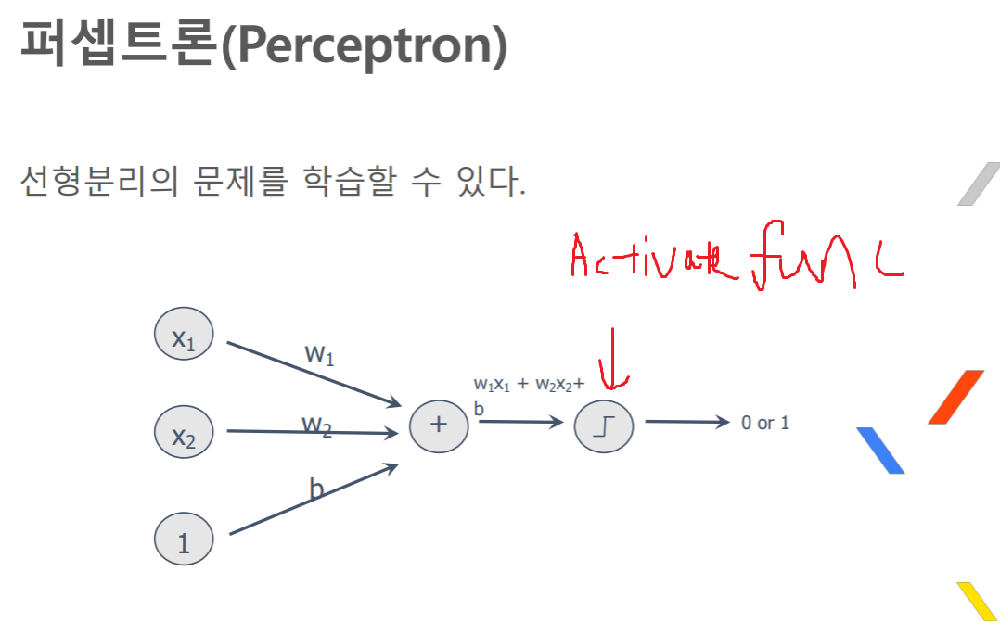
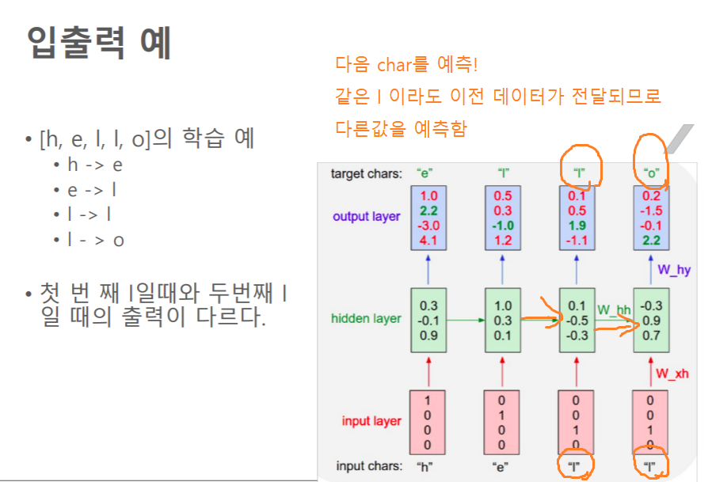

# 2019/01/17 SK 토크온 세미나

## 용어

    feature : 크기, 색깔, 등등의 분류의 기준이 될 특성

    각 feature의 값만을 입력벡터로 나타냄 (크기, 색깔) = (3, 2)

    weight : 각 입력(feature)에 곱해지는 가중치




## Optimizer 종류
    GD(Gradient Descent)

    Batch GD

    Mini-Batch GD..

    batch는 gpu가 병렬처리를 할수 있는 방법임
    batch는 동시에 여러 데이터를 처리해서 결과를 하나하나 적용하지 않고 둘의 평균 등으로 적용함 -> 완벽하지 않음 but 병렬화로 빠르게 학습가능
    batch를 사용하지 않는다면 cpu와 다를바가 없음
    batch 사이즈를 조정하여 학습률을 최대회 할수 있음

## Overfitting 방지

    DropOut

    BN(Batch Normalization)

    Regularization

    Data Augmentation (데이터의 양을 증가시키는 방법)

## Activation Function 종류

    비선형의 함수를 사용해야함

    sigmoid

    Tanh

    ReLU

    Leaky ReLU

## Learning Rate

    학습률 
    W(Weight)의 변경되는 정도

## SoftMax

    Activation function중 하나

    최종 출력층에 사용되며, 여러개의 출력 노드의 합 중에 비중의 값으로 나타낸다.


## BackPropagation

    출력된 값과 원하는 값의 차이를 가지고 그 전의 W 값들을 변경하는 알고리즘

    뒤에서부터(출력층) 그 오차의 값이 전파된다는 의미

    실제로 변경되는 값의 크기는 GD로 결정됨


## LAB: IRIS

    [설명]
    feature는 4가지 (꽃받침 폭, 꽃받침 길이, 꽃잎 폭, 꽃잎 길이) 4차원 벡터
    분류할 종류는 3가지 (Setosa, Versicolor, Virginica)

    [MLP 모델]
    입력노드수 : 4개
    히든레이어 : 3개
    히든레이어의 노드수 : 10, 20, 10 개
    출력노드수 : 3개

    
    [학습데이터] (Iris/iris_training.csv)
    (헤더정보: 데이터 120개, 4차원 입력벡터, 3가지 분류)
    (데이터정보: 순서데로 feature 4개, 분류(정답) 1개)
    120,4,setosa,versicolor,virginica
    6.4,2.8,5.6,2.2,2
    5.0,2.3,3.3,1.0,1
    4.9,2.5,4.5,1.7,2
    4.9,3.1,1.5,0.1,0
    ...

```py
# from __future__ import absolute_import
from __future__ import division
from __future__ import print_function

import os
import urllib.request

import numpy as np
import tensorflow as tf


# Data sets
IRIS_TRAINING = "./iris_training.csv"
IRIS_TRAINING_URL = "http://download.tensorflow.org/data/iris_training.csv"

IRIS_TEST = "./iris_test.csv"
IRIS_TEST_URL = "http://download.tensorflow.org/data/iris_test.csv"

def main():
  # If the training and test sets aren't stored locally, download them.
  if not os.path.exists(IRIS_TRAINING):
    raw = urllib.request.urlopen(IRIS_TRAINING_URL).read()
    with open(IRIS_TRAINING, "w") as f:
      f.write(raw)

  if not os.path.exists(IRIS_TEST):
    raw = urllib.request.urlopen(IRIS_TEST_URL).read()
    with open(IRIS_TEST, "w") as f:
      f.write(raw)

  # Load datasets.
  training_set = tf.contrib.learn.datasets.base.load_csv_with_header(
      filename=IRIS_TRAINING,
      target_dtype=np.int,
      features_dtype=np.float32)
  test_set = tf.contrib.learn.datasets.base.load_csv_with_header(
      filename=IRIS_TEST,
      target_dtype=np.int,
      features_dtype=np.float32)

  # Specify that all features have real-value data
  feature_columns = [tf.contrib.layers.real_valued_column("", dimension=4)]

  # Build 3 layer DNN with 10, 20, 10 units respectively.
  classifier = tf.contrib.learn.DNNClassifier(feature_columns=feature_columns,
                                              hidden_units=[10, 20, 10],
                                              n_classes=3,
                                              model_dir="iris_model")
    # DNNClassfier 모델을 만들고, 히든레이어가 10, 20, 10 개의 노드를 가진 3층구조고, 모델의 경로는 iris_model


  # Define the training inputs
  def get_train_inputs():
    x = tf.constant(training_set.data)
    y = tf.constant(training_set.target)

    return x, y

  # Fit model.
  classifier.fit(input_fn=get_train_inputs, steps=2000)

  # Define the test inputs
  def get_test_inputs():
    x = tf.constant(test_set.data)
    y = tf.constant(test_set.target)

    return x, y

  # Evaluate accuracy.
  accuracy_score = classifier.evaluate(input_fn=get_test_inputs,
                                       steps=1)["accuracy"]

  print("\nTest Accuracy: {0:f}\n".format(accuracy_score))

  # Classify two new flower samples.
  def new_samples():
    return np.array(
      [[6.4, 3.2, 4.5, 1.5],
       [5.8, 3.1, 5.0, 1.7]], dtype=np.float32)

  predictions = list(classifier.predict(input_fn=new_samples))

  print(
      "New Samples, Class Predictions:    {}\n"
      .format(predictions))

if __name__ == "__main__":
    main()

```


## LAB: MNIST

    입력노드수: 784개 (feature) 28 * 28 픽셀의 이미지
    입력노드값: 각각 픽셀의 밝기 정보(0~255)
    히든레이어: 256개 256개 (2층)
    출력노드수: 10개(0~9)

```py
'''
A Multilayer Perceptron implementation example using TensorFlow library.
This example is using the MNIST database of handwritten digits
(http://yann.lecun.com/exdb/mnist/)

Author: Aymeric Damien
Project: https://github.com/aymericdamien/TensorFlow-Examples/
'''

from __future__ import print_function

# Import MNIST data
from tensorflow.examples.tutorials.mnist import input_data
mnist = input_data.read_data_sets("/tmp/data/", one_hot=True)

import tensorflow as tf

# Parameters
learning_rate = 0.001   #학습률
training_epochs = 15    #반복은 15번
batch_size = 100        #배치 사이즈 (100개씩 처리)
display_step = 1

# Network Parameters
n_hidden_1 = 256 # 1st layer number of features
n_hidden_2 = 256 # 2nd layer number of features
n_input = 784 # MNIST data input (img shape: 28*28)
n_classes = 10 # MNIST total classes (0-9 digits)

# tf Graph input
x = tf.placeholder("float", [None, n_input])
y = tf.placeholder("float", [None, n_classes])


# 모델 정의
# Create model
def multilayer_perceptron(x, weights, biases):
    # Hidden layer with RELU activation
    layer_1 = tf.add(tf.matmul(x, weights['h1']), biases['b1'])         # W * x + b
    layer_1 = tf.nn.relu(layer_1)                                       # 활성화함수 적용
    # Hidden layer with RELU activation
    layer_2 = tf.add(tf.matmul(layer_1, weights['h2']), biases['b2'])   # W * x + b
    layer_2 = tf.nn.relu(layer_2)                                       # 활성화함수 적용
    # Output layer with linear activation
    out_layer = tf.matmul(layer_2, weights['out']) + biases['out']      # W * x + b
    return out_layer                                                    # 결과 반환

# Store layers weight & bias
weights = {
    'h1': tf.Variable(tf.random_normal([n_input, n_hidden_1])),
    'h2': tf.Variable(tf.random_normal([n_hidden_1, n_hidden_2])),
    'out': tf.Variable(tf.random_normal([n_hidden_2, n_classes]))
}
biases = {
    'b1': tf.Variable(tf.random_normal([n_hidden_1])),
    'b2': tf.Variable(tf.random_normal([n_hidden_2])),
    'out': tf.Variable(tf.random_normal([n_classes]))
}

# Construct model
pred = multilayer_perceptron(x, weights, biases)

# Define loss and optimizer
cost = tf.reduce_mean(tf.nn.softmax_cross_entropy_with_logits(logits=pred, labels=y))
optimizer = tf.train.AdamOptimizer(learning_rate=learning_rate).minimize(cost)

# Initializing the variables
init = tf.global_variables_initializer()

# Launch the graph
with tf.Session() as sess:
    sess.run(init)

    # Training cycle
    for epoch in range(training_epochs):
        avg_cost = 0.
        total_batch = int(mnist.train.num_examples/batch_size)
        
        # Loop over all batches
        # 배치(100개) 반복
        for i in range(total_batch):
            batch_x, batch_y = mnist.train.next_batch(batch_size)
            # Run optimization op (backprop) and cost op (to get loss value)
            _, c = sess.run([optimizer, cost], feed_dict={x: batch_x,
                                                          y: batch_y})
            # Compute average loss
            avg_cost += c / total_batch
        # Display logs per epoch step
        if epoch % display_step == 0:
            print("Epoch:", '%04d' % (epoch+1), "cost=", \
                "{:.9f}".format(avg_cost))
    print("Optimization Finished!")

    # Test model
    correct_prediction = tf.equal(tf.argmax(pred, 1), tf.argmax(y, 1))
    # Calculate accuracy
    accuracy = tf.reduce_mean(tf.cast(correct_prediction, "float"))
    print("Accuracy:", accuracy.eval({x: mnist.test.images, y: mnist.test.labels}))

```

## CNN(Convolutional NN) 

    Convolution filter와 pooling을 반복함 이후엔 일반 DNN에 적용

    Convolution filter란 nxn 크기의 필터로 입럭데이터를 줄임

    Stride : 필터 적용 시의 이동 칸 수
    Padding : 필터를 적용하다보면 테두리는 적용못함.. -> 패딩으로 일정한 값으로 테두리가 있다고 가정하고 계산함

    Max Pooling : 필터처리가 끝난뒤 필터중 가장 큰값만 가져와서 적용


## LAB: CNN으로 구현한 MNIST 분류기


```py
# 신경망 구성을 손쉽게 해 주는 유틸리티 모음인 tensorflow.layers 를 사용해봅니다.
# 01 - CNN.py 를 재구성한 것이니, 소스를 한 번 비교해보세요.
# 이처럼 TensorFlow 에는 간단하게 사용할 수 있는 다양한 함수와 유틸리티들이 매우 많이 마련되어 있습니다.
# 다만, 처음에는 기본적인 개념에 익숙히지는 것이 좋으므로 이후에도 가급적 기본 함수들을 이용하도록 하겠습니다.
import tensorflow as tf

from tensorflow.examples.tutorials.mnist import input_data
mnist = input_data.read_data_sets("../mnist/data/", one_hot=True)

#########
# 신경망 모델 구성
######
X = tf.placeholder(tf.float32, [None, 28, 28, 1])
Y = tf.placeholder(tf.float32, [None, 10])
is_training = tf.placeholder(tf.bool)

# 기본적으로 inputs, outputs size, kernel_size 만 넣어주면
# 활성화 함수 적용은 물론, 컨볼루션 신경망을 만들기 위한 나머지 수치들은 알아서 계산해줍니다.
# 특히 Weights 를 계산하는데 xavier_initializer 를 쓰고 있는 등,
# 크게 신경쓰지 않아도 일반적으로 효율적인 신경망을 만들어줍니다.
L1 = tf.layers.conv2d(X, 32, [3, 3])                # 3x3 필터를 32개 적용
L1 = tf.layers.max_pooling2d(L1, [2, 2], [2, 2])    # Stride, Padding 을 적용하여 맥스풀링
L1 = tf.layers.dropout(L1, 0.7, is_training)        # Overfitting 방지

L2 = tf.layers.conv2d(L1, 64, [3, 3])               # 3x3 필터를 64개 적용
L2 = tf.layers.max_pooling2d(L2, [2, 2], [2, 2])    # Stride, Padding 을 적용하여 맥스풀링
L2 = tf.layers.dropout(L2, 0.7, is_training)        # Overfitting 방지

L3 = tf.contrib.layers.flatten(L2)                  # 2x2 데이터.. 등을 한줄의 데이터로 flatten
L3 = tf.layers.dense(L3, 256, activation=tf.nn.relu)# DNN레이어에 적용
L3 = tf.layers.dropout(L3, 0.5, is_training)        # Overfitting 방지

model = tf.layers.dense(L3, 10, activation=None)

cost = tf.reduce_mean(tf.nn.softmax_cross_entropy_with_logits(logits=model, labels=Y))
optimizer = tf.train.AdamOptimizer(0.001).minimize(cost)

#########
# 신경망 모델 학습
######
init = tf.global_variables_initializer()
sess = tf.Session()
sess.run(init)

batch_size = 100
total_batch = int(mnist.train.num_examples/batch_size)

for epoch in range(15):
    total_cost = 0

    for i in range(total_batch):
        batch_xs, batch_ys = mnist.train.next_batch(batch_size)
        batch_xs = batch_xs.reshape(-1, 28, 28, 1)
        _, cost_val = sess.run([optimizer, cost],
                               feed_dict={X: batch_xs,
                                          Y: batch_ys,
                                          is_training: True})
        total_cost += cost_val

    print('Epoch:', '%04d' % (epoch + 1),
          'Avg. cost =', '{:.4f}'.format(total_cost / total_batch))

print('최적화 완료!')

#########
# 결과 확인
######
is_correct = tf.equal(tf.argmax(model, 1), tf.argmax(Y, 1))
accuracy = tf.reduce_mean(tf.cast(is_correct, tf.float32))
print('정확도:', sess.run(accuracy,
                        feed_dict={X: mnist.test.images.reshape(-1, 28, 28, 1),
                                   Y: mnist.test.labels,
                                   is_training: False}))
```


## GAN (Generative Adversarial Networks)

    지도학습을 할떄는 레이블링된 데이터가 필요함 (비싸고 구하기 힘듬)

    비지도학습으로 스스로 학습데이터를 생성해서 사용하자


```py
# 2016년에 가장 관심을 많이 받았던 비감독(Unsupervised) 학습 방법인
# Generative Adversarial Network(GAN)을 구현해봅니다.
# https://arxiv.org/abs/1406.2661
import tensorflow as tf
import matplotlib.pyplot as plt
import numpy as np

from tensorflow.examples.tutorials.mnist import input_data
mnist = input_data.read_data_sets("../mnist/data/", one_hot=True)

#########
# 옵션 설정
######
total_epoch = 100
batch_size = 100
learning_rate = 0.0002
# 신경망 레이어 구성 옵션
n_hidden = 256
n_input = 28 * 28
n_noise = 128  # 생성기의 입력값으로 사용할 노이즈의 크기

#########
# 신경망 모델 구성
######
# GAN 도 Unsupervised 학습이므로 Autoencoder 처럼 Y 를 사용하지 않습니다.
X = tf.placeholder(tf.float32, [None, n_input])
# 노이즈 Z를 입력값으로 사용합니다.
Z = tf.placeholder(tf.float32, [None, n_noise])

# 생성기 신경망에 사용하는 변수들입니다.
G_W1 = tf.Variable(tf.random_normal([n_noise, n_hidden], stddev=0.01))
G_b1 = tf.Variable(tf.zeros([n_hidden]))
G_W2 = tf.Variable(tf.random_normal([n_hidden, n_input], stddev=0.01))
G_b2 = tf.Variable(tf.zeros([n_input]))

# 판별기 신경망에 사용하는 변수들입니다.
D_W1 = tf.Variable(tf.random_normal([n_input, n_hidden], stddev=0.01))
D_b1 = tf.Variable(tf.zeros([n_hidden]))
# 판별기의 최종 결과값은 얼마나 진짜와 가깝냐를 판단하는 한 개의 스칼라값입니다.
D_W2 = tf.Variable(tf.random_normal([n_hidden, 1], stddev=0.01))
D_b2 = tf.Variable(tf.zeros([1]))


# 생성기(G) 신경망을 구성합니다.
def generator(noise_z):
    hidden = tf.nn.relu(
                    tf.matmul(noise_z, G_W1) + G_b1)
    output = tf.nn.sigmoid(
                    tf.matmul(hidden, G_W2) + G_b2)

    return output


# 판별기(D) 신경망을 구성합니다.
def discriminator(inputs):
    hidden = tf.nn.relu(
                    tf.matmul(inputs, D_W1) + D_b1)
    output = tf.nn.sigmoid(
                    tf.matmul(hidden, D_W2) + D_b2)

    return output


# 랜덤한 노이즈(Z)를 만듭니다.
def get_noise(batch_size, n_noise):
    return np.random.normal(size=(batch_size, n_noise))


# 노이즈를 이용해 랜덤한 이미지를 생성합니다.
G = generator(Z)
# 노이즈를 이용해 생성한 이미지가 진짜 이미지인지 판별한 값을 구합니다.
D_gene = discriminator(G)
# 진짜 이미지를 이용해 판별한 값을 구합니다.
D_real = discriminator(X)

# 논문에 따르면, GAN 모델의 최적화는 loss_G 와 loss_D 를 최대화 하는 것 입니다.
# 다만 loss_D와 loss_G는 서로 연관관계가 있기 때문에 두 개의 손실값이 항상 같이 증가하는 경향을 보이지는 않을 것 입니다.
# loss_D가 증가하려면 loss_G는 하락해야하고, loss_G가 증가하려면 loss_D는 하락해야하는 경쟁관계에 있기 때문입니다.
# 논문의 수식에 따른 다음 로직을 보면 loss_D 를 최대화하기 위해서는 D_gene 값을 최소화하게 됩니다.
# 판별기에 진짜 이미지를 넣었을 때에도 최대값을 : tf.log(D_real)
# 가짜 이미지를 넣었을 때에도 최대값을 : tf.log(1 - D_gene)
# 갖도록 학습시키기 때문입니다.
# 이것은 판별기는 생성기가 만들어낸 이미지가 가짜라고 판단하도록 판별기 신경망을 학습시킵니다.
loss_D = tf.reduce_mean(tf.log(D_real) + tf.log(1 - D_gene))
# 반면 loss_G 를 최대화하기 위해서는 D_gene 값을 최대화하게 되는데,
# 이것은 가짜 이미지를 넣었을 때, 판별기가 최대한 실제 이미지라고 판단하도록 생성기 신경망을 학습시킵니다.
# 논문에서는 loss_D 와 같은 수식으로 최소화 하는 생성기를 찾지만,
# 결국 D_gene 값을 최대화하는 것이므로 다음과 같이 사용할 수 있습니다.
loss_G = tf.reduce_mean(tf.log(D_gene))

# loss_D 를 구할 때는 판별기 신경망에 사용되는 변수만 사용하고,
# loss_G 를 구할 때는 생성기 신경망에 사용되는 변수만 사용하여 최적화를 합니다.
D_var_list = [D_W1, D_b1, D_W2, D_b2]
G_var_list = [G_W1, G_b1, G_W2, G_b2]

# GAN 논문의 수식에 따르면 loss 를 극대화 해야하지만, minimize 하는 최적화 함수를 사용하기 때문에
# 최적화 하려는 loss_D 와 loss_G 에 음수 부호를 붙여줍니다.
train_D = tf.train.AdamOptimizer(learning_rate).minimize(-loss_D,
                                                         var_list=D_var_list)
train_G = tf.train.AdamOptimizer(learning_rate).minimize(-loss_G,
                                                         var_list=G_var_list)

#########
# 신경망 모델 학습
######
sess = tf.Session()
sess.run(tf.global_variables_initializer())

total_batch = int(mnist.train.num_examples/batch_size)
loss_val_D, loss_val_G = 0, 0

for epoch in range(total_epoch):
    for i in range(total_batch):
        batch_xs, batch_ys = mnist.train.next_batch(batch_size)
        noise = get_noise(batch_size, n_noise)

        # 판별기와 생성기 신경망을 각각 학습시킵니다.
        _, loss_val_D = sess.run([train_D, loss_D],
                                 feed_dict={X: batch_xs, Z: noise})
        _, loss_val_G = sess.run([train_G, loss_G],
                                 feed_dict={Z: noise})

    print('Epoch:', '%04d' % epoch,
          'D loss: {:.4}'.format(loss_val_D),
          'G loss: {:.4}'.format(loss_val_G))

    #########
    # 학습이 되어가는 모습을 보기 위해 주기적으로 이미지를 생성하여 저장
    ######
    if epoch == 0 or (epoch + 1) % 10 == 0:
        sample_size = 10
        noise = get_noise(sample_size, n_noise)
        samples = sess.run(G, feed_dict={Z: noise})

        fig, ax = plt.subplots(1, sample_size, figsize=(sample_size, 1))

        for i in range(sample_size):
            ax[i].set_axis_off()
            ax[i].imshow(np.reshape(samples[i], (28, 28)))

        plt.savefig('samples/{}.png'.format(str(epoch).zfill(3)), bbox_inches='tight')
        plt.close(fig)

print('최적화 완료!')
```


## RNN(Recurrent NN)

    상태를 가지고 있고, 다음 연산때 그 상태가 입력으로 사용된다.
    시계열 데이터를 학습하는데에 이점..(but CNN도 시계열 잘함)



