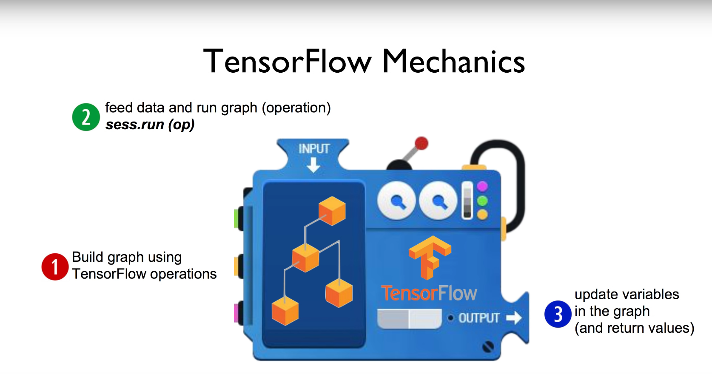

## ML lab 01 - TensorFlow의 설치및 기본적인 operations (new)
[https://youtu.be/-57Ne86Ia8w]

```py
import tensorflow as tf

node1 = tf.constant(3.0, tf.float32)
node2 = tf.constant(4.0)
node3 = tf.add(node1, node2)

print(node3)    # Tensor("Add:0", shape=(), dtype=float32)

sess = tf.Session()
print("sess.run(node1, node2)", sess.run([node1, node2]))   # sess.run(node1, node2) [3.0, 4.0]
print("sess.run(node3)", sess.run(node3))   # sess.run(node3) 7.0
```

    Session을 생성하고, run(실행) 함으로써 텐서플로우는 연산작업을 수행
    그냥 노드를 print 해보면 타입, 형식등의 정보를 출력함

### 텐서플로우 실행도





### Placeholder

```py
import tensorflow as tf

a = tf.placeholder(tf.float32)
b = tf.placeholder(tf.float32)
adder_node = a + b

sess = tf.Session()

print(sess.run(adder_node, feed_dict={a: 3, b: 4.5}))   # 7.5
print(sess.run(adder_node, feed_dict={a: [1, 3], b: [2, 4]})) # [3. 7.]
```
    placeholder node를 사용하면 그래프가 실행될때 feed_dict를 통해 값을 넘겨주며 실행
    넘겨주는 값은 여러타입(배열, 정수, 실수...) 가능


### Tensor / Ranks, Shapes and Types

1. Rank
    몇차원의 텐서인지

    Rank 0 : Scalar         |   s = 423
    Rank 1 : Vector         |   v = [1.1, 2.0, 3.2]
    Rank 2 : Matrix         |   m = [[1,2,3],[4,5,6]]
    Rank 3 : 3-Tensor       |   t = [ [[2],[4],[6]], [[8],[9],[4]] ]

2. Shape
    몇개의 원소를 가지고 있는지

    t = [[1,2,3], [4,5,6], [7,8,9]]
    shape = [3,3]           |   3개짜리를 3개가지고 있음

3. Type
    데이터 형식

    DT_FLOAT    tf.float32
    DT_DOUBLE   tf.float64
    DT_INT32    tf.int32