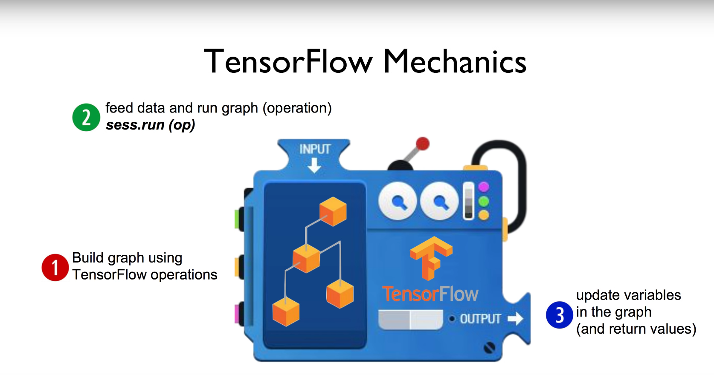

## ML lab 01 - TensorFlow의 설치및 기본적인 operations (new)
[https://youtu.be/-57Ne86Ia8w]

```py
import tensorflow as tf

node1 = tf.constant(3.0, tf.float32)
node2 = tf.constant(4.0)
node3 = tf.add(node1, node2)

print(node3)    # Tensor("Add:0", shape=(), dtype=float32)

sess = tf.Session()
print("sess.run(node1, node2)", sess.run([node1, node2]))   # sess.run(node1, node2) [3.0, 4.0]
print("sess.run(node3)", sess.run(node3))   # sess.run(node3) 7.0
```

    Session을 생성하고, run(실행) 함으로써 텐서플로우는 연산작업을 수행
    그냥 노드를 print 해보면 타입, 형식등의 정보를 출력함

### 텐서플로우 실행도



