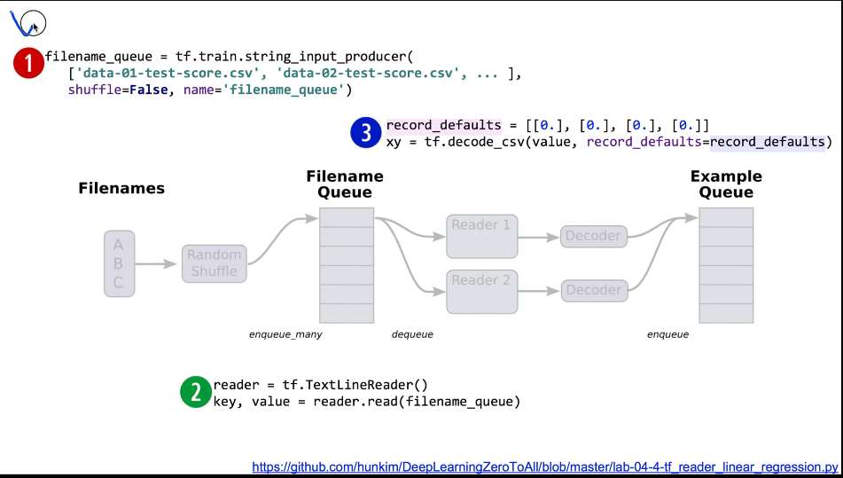

## ML lab 04-1: multi-variable linear regression을 TensorFlow에서 구현하기 (new)
[https://youtu.be/fZUV3xjoZSM]

### Matrix로 여러데이터 표현하기

```py
# Lab 4 Multi-variable linear regression
import tensorflow as tf
tf.set_random_seed(777)  # for reproducibility

x_data = [[73., 80., 75.],
          [93., 88., 93.],
          [89., 91., 90.],
          [96., 98., 100.],
          [73., 66., 70.]]
y_data = [[152.],
          [185.],
          [180.],
          [196.],
          [142.]]


# placeholders for a tensor that will be always fed.
X = tf.placeholder(tf.float32, shape=[None, 3]) 
Y = tf.placeholder(tf.float32, shape=[None, 1])
# 몇개의 인스턴스가 들어올지 정하지 않으려면 None으로 설정

W = tf.Variable(tf.random_normal([3, 1]), name='weight')
b = tf.Variable(tf.random_normal([1]), name='bias')

# Hypothesis
hypothesis = tf.matmul(X, W) + b

# Simplified cost/loss function
cost = tf.reduce_mean(tf.square(hypothesis - Y))

# Minimize
optimizer = tf.train.GradientDescentOptimizer(learning_rate=1e-5)
train = optimizer.minimize(cost)

# Launch the graph in a session.
sess = tf.Session()
# Initializes global variables in the graph.
sess.run(tf.global_variables_initializer())

for step in range(2001):
    cost_val, hy_val, _ = sess.run(
        [cost, hypothesis, train], feed_dict={X: x_data, Y: y_data})
    if step % 10 == 0:
        print(step, "Cost: ", cost_val, "\nPrediction:\n", hy_val)

'''
0 Cost:  7105.46
Prediction:
 [[ 80.82241058]
 [ 92.26364136]
 [ 93.70250702]
 [ 98.09217834]
 [ 72.51759338]]

2000 Cost:  3.1781
Prediction:
 [[ 154.35881042]
 [ 182.95147705]
 [ 181.85035706]
 [ 194.35533142]
 [ 142.036026  ]]

'''
```

```py
x1_data = [73., 93., 89., 96., 73.]
x2_data = [80., 88., 91., 98., 66.]
x3_data = [75., 93., 90., 100., 70.]

y_data = [152., 185., 180., 196., 142.]

# placeholders for a tensor that will be always fed.
x1 = tf.placeholder(tf.float32)
x2 = tf.placeholder(tf.float32)
x3 = tf.placeholder(tf.float32)

Y = tf.placeholder(tf.float32)

w1 = tf.Variable(tf.random_normal([1]), name='weight1')
w2 = tf.Variable(tf.random_normal([1]), name='weight2')
w3 = tf.Variable(tf.random_normal([1]), name='weight3')
b = tf.Variable(tf.random_normal([1]), name='bias')

hypothesis = x1 * w1 + x2 * w2 + x3 * w3 + b
```
    만약 메트릭스가 아니였다면 다음과 같이 표현했어야함


### LAB04-02: Tensorflow로 파일에서 데이터 읽어오기

```py
# Lab 4 Multi-variable linear regression
import tensorflow as tf
import numpy as np
tf.set_random_seed(777)  # for reproducibility

# numpy 의 loadtxt 함수를 이용해서 csv 파일 읽기
xy = np.loadtxt('data/data-01-test-score.csv', delimiter=',', dtype=np.float32)
# 한줄에 순서대로 ex1, ex2, ex3, final 점수가 저장됨
# 슬라이싱 해서 사용해야함
x_data = xy[:, 0:-1]    # 모든열, 맨끝행 뺴고 모두
y_data = xy[:, [-1]]    # 모든열, 맨끝행 만

# Make sure the shape and data are OK
print(x_data, "\nx_data shape:", x_data.shape)
print(y_data, "\ny_data shape:", y_data.shape)

# data output
'''
[[ 73.  80.  75.]
 [ 93.  88.  93.]
 ...
 [ 76.  83.  71.]
 [ 96.  93.  95.]] 
x_data shape: (25, 3)
[[152.]
 [185.]
 ...
 [149.]
 [192.]] 
y_data shape: (25, 1)
'''

# placeholders for a tensor that will be always fed.
X = tf.placeholder(tf.float32, shape=[None, 3])
Y = tf.placeholder(tf.float32, shape=[None, 1])

W = tf.Variable(tf.random_normal([3, 1]), name='weight')
b = tf.Variable(tf.random_normal([1]), name='bias')

# Hypothesis
hypothesis = tf.matmul(X, W) + b

# Simplified cost/loss function
cost = tf.reduce_mean(tf.square(hypothesis - Y))

# Minimize
optimizer = tf.train.GradientDescentOptimizer(learning_rate=1e-5)
train = optimizer.minimize(cost)

# Launch the graph in a session.
sess = tf.Session()
# Initializes global variables in the graph.
sess.run(tf.global_variables_initializer())

for step in range(2001):
    cost_val, hy_val, _ = sess.run([cost, hypothesis, train], 
                                   feed_dict={X: x_data, Y: y_data})
    if step % 10 == 0:
        print(step, "Cost:", cost_val, "\nPrediction:\n", hy_val)

# Ask my score
print("Your score will be ", sess.run(hypothesis, 
                                      feed_dict={X: [[100, 70, 101]]}))

print("Other scores will be ", sess.run(hypothesis,
                                        feed_dict={X: [[60, 70, 110], [90, 100, 80]]}))

'''
Your score will be  [[ 181.73277283]]
Other scores will be  [[ 145.86265564]
 [ 187.23129272]]

'''
```

### batch 를 이용한 학습




```py
# Lab 4 Multi-variable linear regression
# https://www.tensorflow.org/programmers_guide/reading_data

import tensorflow as tf
tf.set_random_seed(777)  # for reproducibility

filename_queue = tf.train.string_input_producer(
    ['data-01-test-score.csv'], shuffle=False, name='filename_queue')

reader = tf.TextLineReader()
key, value = reader.read(filename_queue)

# Default values, in case of empty columns. Also specifies the type of the
# decoded result.
record_defaults = [[0.], [0.], [0.], [0.]]
xy = tf.decode_csv(value, record_defaults=record_defaults)

# collect batches of csv in
train_x_batch, train_y_batch = tf.train.batch([xy[0:-1], xy[-1:]], batch_size=10)
# batch 사이즈는 10개씩

# placeholders for a tensor that will be always fed.
X = tf.placeholder(tf.float32, shape=[None, 3])
Y = tf.placeholder(tf.float32, shape=[None, 1])

W = tf.Variable(tf.random_normal([3, 1]), name='weight')
b = tf.Variable(tf.random_normal([1]), name='bias')

# Hypothesis
hypothesis = tf.matmul(X, W) + b

# Simplified cost/loss function
cost = tf.reduce_mean(tf.square(hypothesis - Y))

# Minimize
optimizer = tf.train.GradientDescentOptimizer(learning_rate=1e-5)
train = optimizer.minimize(cost)

# Launch the graph in a session.
sess = tf.Session()
# Initializes global variables in the graph.
sess.run(tf.global_variables_initializer())

# Start populating the filename queue.
coord = tf.train.Coordinator()
threads = tf.train.start_queue_runners(sess=sess, coord=coord)

for step in range(2001):
    x_batch, y_batch = sess.run([train_x_batch, train_y_batch])
    cost_val, hy_val, _ = sess.run(
        [cost, hypothesis, train], feed_dict={X: x_batch, Y: y_batch})
    if step % 10 == 0:
        print(step, "Cost: ", cost_val, "\nPrediction:\n", hy_val)

coord.request_stop()
coord.join(threads)

# Ask my score
print("Your score will be ",
      sess.run(hypothesis, feed_dict={X: [[100, 70, 101]]}))

print("Other scores will be ",
      sess.run(hypothesis, feed_dict={X: [[60, 70, 110], [90, 100, 80]]}))

'''
Your score will be  [[185.33531]]
Other scores will be  [[178.36246]
 [177.03687]]
'''
```

```py
# collect batches of csv in
train_x_batch, train_y_batch = tf.train.batch([xy[0:-1], xy[-1:]], batch_size=10)
# batch 사이즈는 10개씩
```
    xy[0:-1] 은 x_data , xy[-1:] 은 y_data 인데
    batch 사이즈가 10으로 정해졌으므로 행은 무조건 10개씩 들어옴 (10줄)
    그러므로 열만 슬라이싱하고, 행은 슬라이싱 하지 않았음