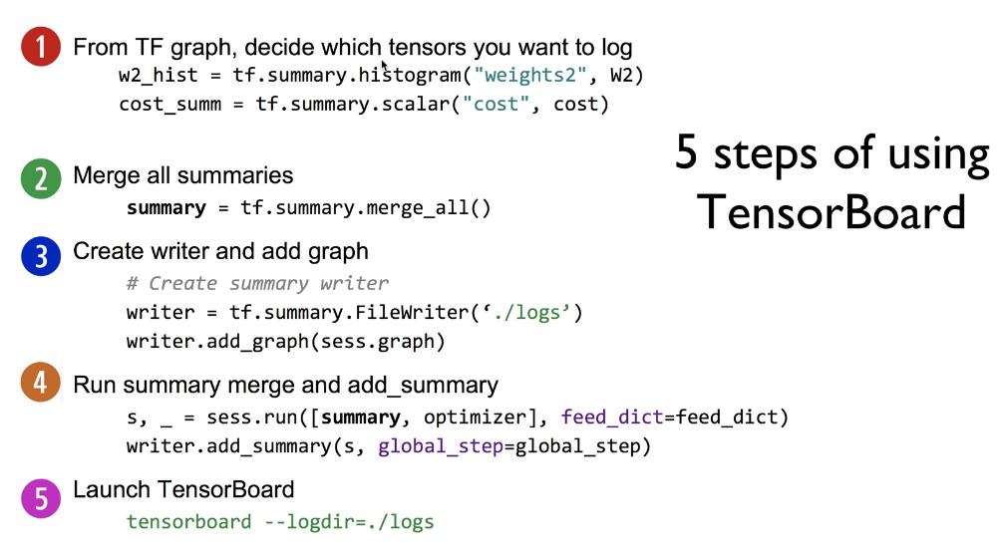
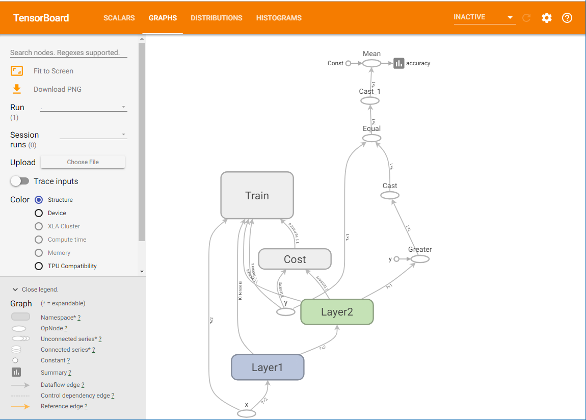

## ML lab 09-1: Neural Net for XOR
[https://youtu.be/oFGHOsAYiz0]


## ML lab 09-2: Tensorboard (Neural Net for XOR)
[https://youtu.be/lmrWZPFYjHM]

### 텐서 보드 사용하기



    tf.summary 를 통해 그래프에 표시할 (logging) 텐서를 추가한다

    tf.summary.merge_all() 을 통해 모든 summary들을 합친다


    writer = tf.summary.FileWriter("./logs/xor_logs_r0_01")

    그래프를 지정한 디렉토리에 저장한다

    writer.add_graph(sess.graph)  # Show the graph

    이후 summary를 세션에 넣어 실행시킨다.


    tensorboard --logdir=./logs/xor_logs_r0_01 

    텐서보드를 터미널에서 실행시키면 localhost:6006 에 serve 된다

    [tips]
    텐서 보드를 사용할때 여러 노드들이 난잡하게 표현되지 않도록
    with tf.name_scope("name"): 구문을 사용하여 텐서보드에 한덩이의 노드로 표현할 수 있다.


```py
# Lab 9 XOR
import tensorflow as tf
import numpy as np

tf.set_random_seed(777)  # for reproducibility

x_data = np.array([[0, 0], [0, 1], [1, 0], [1, 1]], dtype=np.float32)
y_data = np.array([[0], [1], [1], [0]], dtype=np.float32)

X = tf.placeholder(tf.float32, [None, 2], name="x")
Y = tf.placeholder(tf.float32, [None, 1], name="y")

with tf.name_scope("Layer1"):
    W1 = tf.Variable(tf.random_normal([2, 2]), name="weight_1")
    b1 = tf.Variable(tf.random_normal([2]), name="bias_1")
    layer1 = tf.sigmoid(tf.matmul(X, W1) + b1)

    tf.summary.histogram("W1", W1)
    tf.summary.histogram("b1", b1)
    tf.summary.histogram("Layer1", layer1)


with tf.name_scope("Layer2"):
    W2 = tf.Variable(tf.random_normal([2, 1]), name="weight_2")
    b2 = tf.Variable(tf.random_normal([1]), name="bias_2")
    hypothesis = tf.sigmoid(tf.matmul(layer1, W2) + b2)

    tf.summary.histogram("W2", W2)
    tf.summary.histogram("b2", b2)
    tf.summary.histogram("Hypothesis", hypothesis)

# cost/loss function
with tf.name_scope("Cost"):
    cost = -tf.reduce_mean(Y * tf.log(hypothesis) + (1 - Y) * tf.log(1 - hypothesis))
    tf.summary.scalar("Cost", cost)

with tf.name_scope("Train"):
    train = tf.train.AdamOptimizer(learning_rate=0.01).minimize(cost)

# Accuracy computation
# True if hypothesis>0.5 else False
predicted = tf.cast(hypothesis > 0.5, dtype=tf.float32)
accuracy = tf.reduce_mean(tf.cast(tf.equal(predicted, Y), dtype=tf.float32))
tf.summary.scalar("accuracy", accuracy)

# Launch graph
with tf.Session() as sess:
    # tensorboard --logdir=./logs/xor_logs
    merged_summary = tf.summary.merge_all()
    writer = tf.summary.FileWriter("./logs/xor_logs_r0_01")
    writer.add_graph(sess.graph)  # Show the graph

    # Initialize TensorFlow variables
    sess.run(tf.global_variables_initializer())

    for step in range(10001):
        _, summary, cost_val = sess.run(
            [train, merged_summary, cost], feed_dict={X: x_data, Y: y_data}
        )
        writer.add_summary(summary, global_step=step)

        if step % 100 == 0:
            print(step, cost_val)

    # Accuracy report
    h, p, a = sess.run(
        [hypothesis, predicted, accuracy], feed_dict={X: x_data, Y: y_data}
    )
    
    print(f"\nHypothesis:\n{h} \nPredicted:\n{p} \nAccuracy:\n{a}")

"""
Hypothesis:
[[6.1310326e-05]
 [9.9993694e-01]
 [9.9995077e-01]
 [5.9751470e-05]] 
Predicted:
[[0.]
 [1.]
 [1.]
 [0.]] 
Accuracy:
1.0
"""
```



    각 레이어별로, cost, train 노드별로 나눠서 텐서보드에 표현함


> 여러개의 모델(파라메터만 바꾼)의 그래프를 동시에 나타내려면

    tensorboard --logdir=./logs

    다음과 같이 logs 디렉토리에 여러 그래프를 모두 저장하고 통체로 실행시킨다