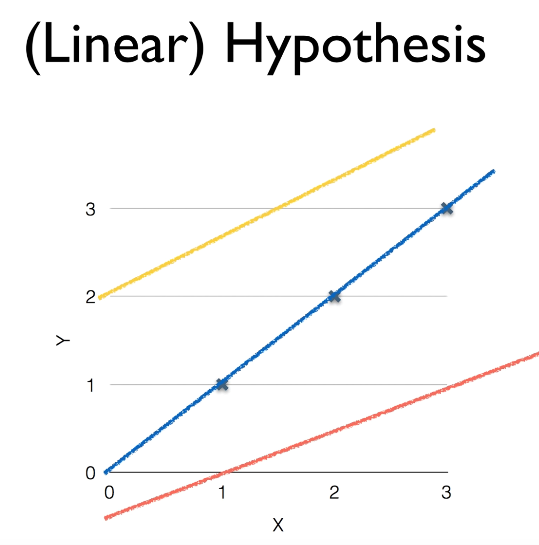
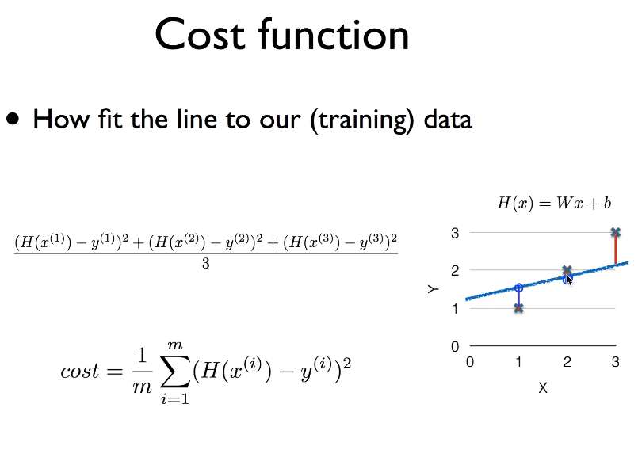
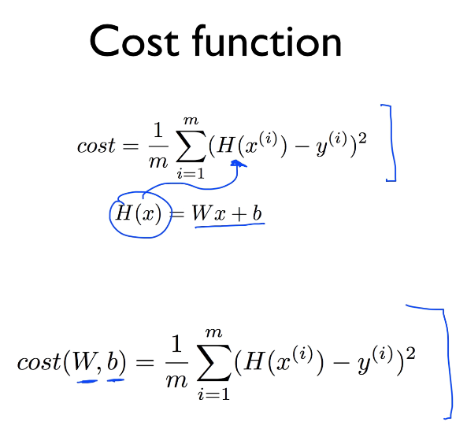

## ML lec 02 - Linear Regression의 Hypothesis 와 cost 설명
[https://youtu.be/Hax03rCn3UI]

### 선형회귀란

    지도학습중 특정범위 (0~100)의 값을 예측하는 모델
    세상의 많은 경우가 Linear로 설명가능함
```
X   |   Y
1   |   1
2   |   2
3   |   3
```




    H(x) = W x + b

    위의 경우에는 W = 1 , b = 0 이 가장 적합한값.

#### Cost function



    cost = (H(x)-y)^2

    제곱으로 계산하게되면 음수양수 문제해결 + 차이가 클수록 더큰 페널티를 줄 수 있음

#### Goal : cost를 최소화 하자

