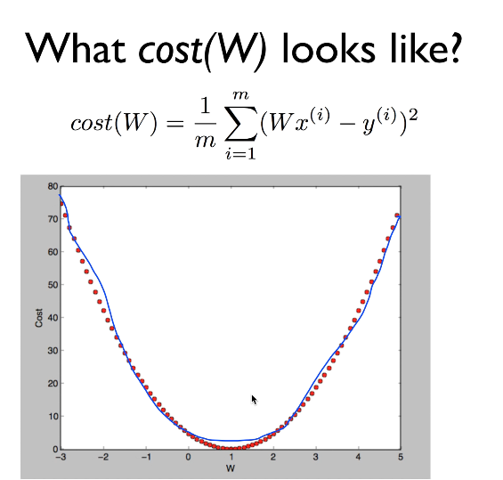
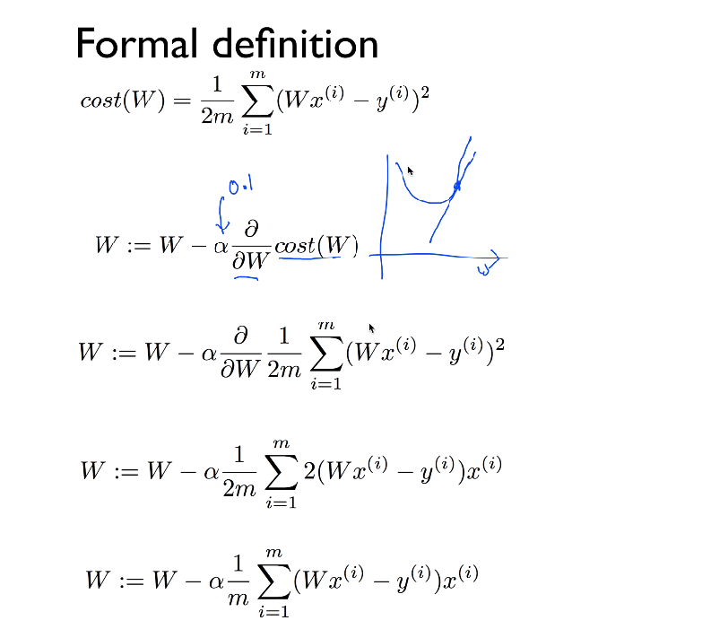

## ML lec 03 - Linear Regression의 cost 최소화 알고리즘의 원리 설명
[https://youtu.be/TxIVr-nk1so]

### cost 최소화 과정

    
    W = 1 일때 cost = 0으로 가장 작은값을 가진다.
    아래의 알고리즘으로 해당 점을 찾아감
### Gradient descent algorithm (경사하강법)

    W-cost 그래프를 그리고  step * 기울기(+,-) 를 뺴서 다시 W를 갱신한다

    local minimum point 보다 현재의 W가 오른쪽이라면 
    식을 계산해서 W가 감소하기 떄문에 최저점으로 가까워진다

### Gradient descent algorithm 의 정확도

    cost function이 Convex function의 모양으로 나타단다면 
    언제나 유일한 최소값을 찾을수 있음을 보장한다.
