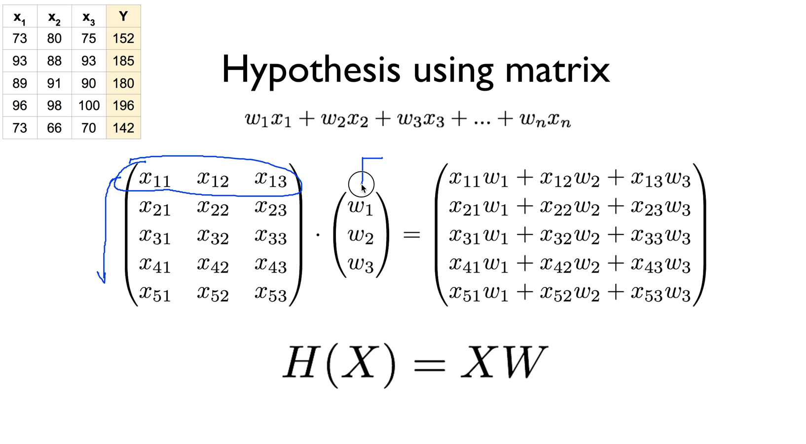
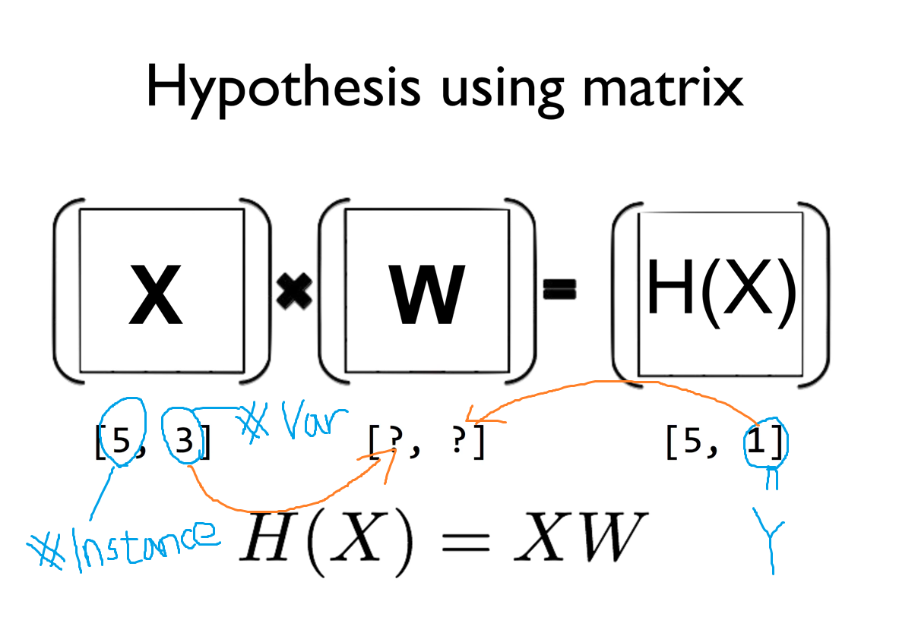

## ML lec 04 - multi-variable linear regression (*new)
[https://youtu.be/kPxpJY6fRkY]

### 여러개의 변수

    H(x1, x2, x3) = w1*x1 + w2*x2 + w3*x3 + b

    cost(W,b) = 1/m sum((H(x1, x2, x3) - y)^2)

    변수가 많이지면서 수식표현이 어려워짐..

    Matrix 곱연산으로 표현

    (x1, x2, x3) * (w1, w2, w3)T = (w1*x1 + w2*x2 + w3*x3)

    == H(X) = W*X

    여러개의 인스턴스(하나의 데이터셋)들을 모두 계산할때 
    Matrix 곱으로 나타내면 한번에 계산할 수 있다

    [5, 3] * [3, 1] = [5, 1]

    W 를 설계하는 방법은 입력데이터의 var 갯수, 원하는 결과값(y) 갯수로 정한다.