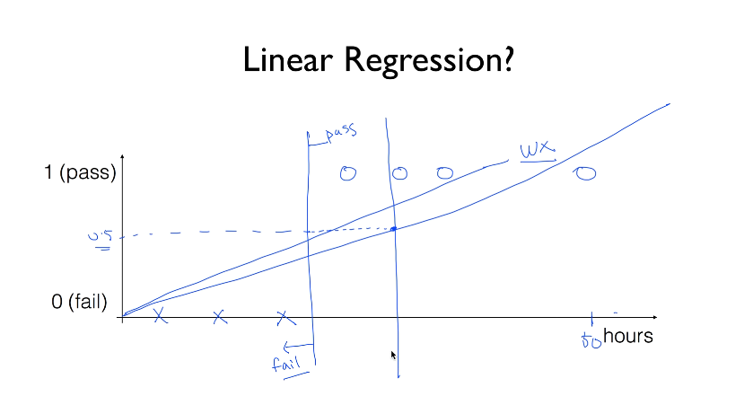
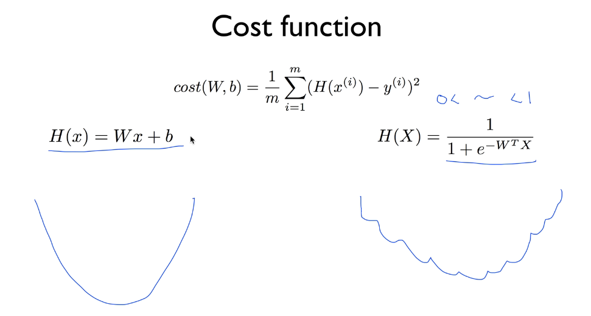
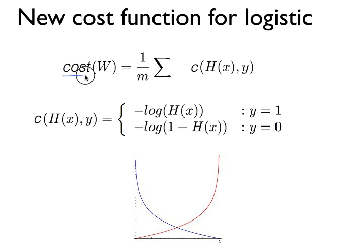
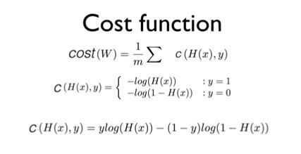
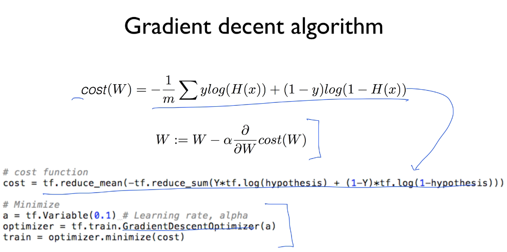

## ML lec 5-1: Logistic Classification의 가설 함수 정의
[https://youtu.be/PIjno6paszY]

### Binary Classification
    
    둘중하나로 분류하는 작업
    
> 0,1 encoding

    결과를 0 or 1 로 표현함

#### Linear regression 으로 할 수 있을까?    

    특정 값이 너무 크거나 너무 작으면 가설(H(X))이 기울어짐..
    기존에 1(합)으로 예측되었던 문제가 0(불합) 으로 예측될 수 있음

### Logistic Hypothesis

    결과값을 0~1 사이로 정규화 해야 한다

    z = W x + b

    logistic, sigmoid 함수를 사용

    g(z) = 1 / ( 1 + e ^ -z)

    H(x) = 1 / ( 1 + e ^ -(WtX))

## ML lec 5-2 Logistic Regression의 cost 함수 설명
[https://youtu.be/6vzchGYEJBc]

### cost function

    기존의 Linear regression Hypothesis로 cost function을 그리면 매끈한 형태

    Logistic Hypothesis로 cost function을 그리면 울퉁불퉁해짐
    -> Local Minimum 에 빠질수 있음
    -> 새로운 cost function이 필요

    울퉁불퉁해진 원인이 e 이므로 log를 통해 해결함

    y = 0 일때 0으로 예측하면 cost = 0
    y = 1 일때 0으로 예측하면 cost = inf

    y = 0 일때 1으로 예측하면 cost = inf
    y = 1 일때 1으로 예측하면 cost = 0

    맨 마지막 식은 y = 1 , y = 0 두 케이스 모두를 처리할 수 있음

    실제 코드에서 구현할때에는 다음과 같이 구현
    (GD 알고리즘은 변하지 않음 cost 만 변했음)