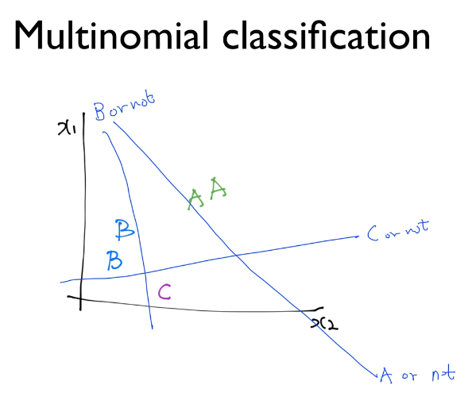
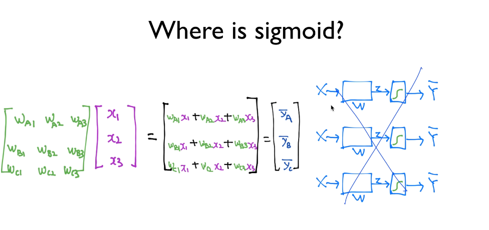
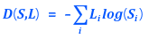
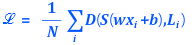

## ML lec 6-1 - Softmax Regression: 기본 개념 소개
[https://youtu.be/MFAnsx1y9ZI]

### Multinomial classification

    이전의 Binary classification 과 다르게 여러가지 분류중 하나로 분류하는 문제

> 그럼 Binary classification (Logisitc Regression) 을 여러번 수행하면 안될까?

    구현할 수 있다. 하지만 복잡하고 각각의 Y-hat 마다 sigmoid를 적용시켜 줘야한다

    다음과 같이 하나의 행렬로 나타내면 간단화 가능

### Sotfmax Regression

    softmax 회귀란 기존의 logistic 회귀와 다르게
    sigmoid 함수를 통해 0~1 사이의 값을 도출하고 이를 분류하는것이 아니라

    softmax 함수를 통해 여러개의 *확률값* 을 도출한다. (sum up to 1)
    그 후에 가장 높은 확률값을 가지는 라벨을 선택하는것이 softwmax regression 이다.

### Softmax Regression의 Cost function

    Cross-Entropy Function

    한개의 원소(인스턴스) 에만 적용할때의 식

    전체 데이터에 적용할 식

> 이후 Cost Function을 최소화 하기 위해 GD알고리즘을 사용한다 (Logistic, Linear와 같음)