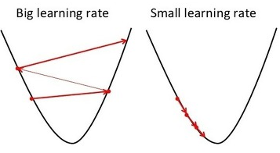
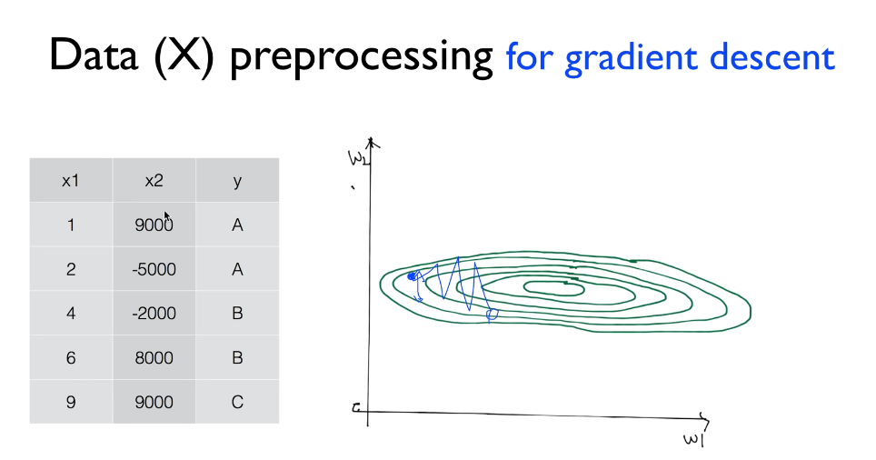
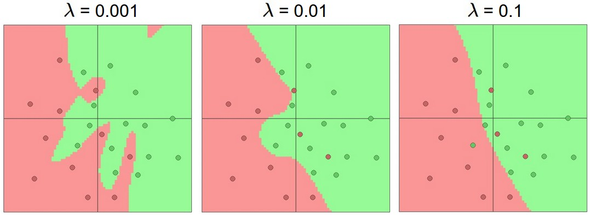
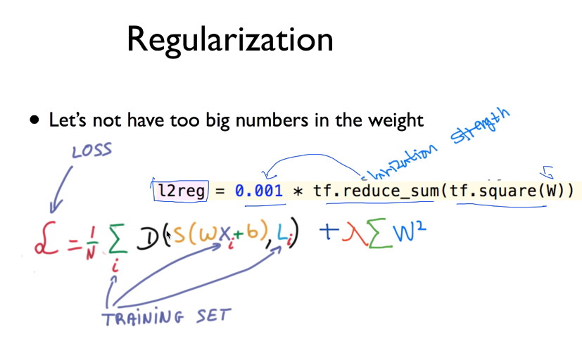
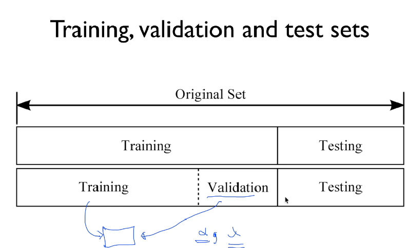

## ML lec 07-1: 학습 rate, Overfitting, 그리고 일반화 (Regularization)
[https://youtu.be/1jPjVoDV_uo]

### Learning rate (학습률)

    Cost Function의 최소값을 찾기위해 GD 알고리즘을 사용한다.

    이때 GD알고리즘의 공식 W = W - a * a/aW cost(W) 를 보면, a가 학습률을 의미함

    학습률이 너무크다면 OverShooting 문제가, 
    너무 작다면 시간이 지나도 최저점에 못가는 문제가 생긴다.

    화면에 cost를 출력해보면서 시간이 지나도 값의 차이가 거의없다면 늘리고,
    발산되는걸 확인하면 줄인다

    처음엔 0.01 정도로 시작..

### Data Preprocessing (데이터 전처리)

    데이터의 분포의 범위가 너무 크다면, 학습이 이뤄지기 어려움

    Nomalization 해서 처리한다

    종류로는 데이터의 중심을 (0,0) 으로 보내고, 분포를 0~1 사이의 범위로 줄이는 방법이 있고,

    특별히 평균, 분산, 표준편차를 이용하는 Nomalization 은 Standardization 라고한다.

### Overfitting (과적합)

    학습모델이 주어진 학습데이터에 너무 적합해진 상태

    가장 좋은 방법은 더많은 학습데이터로 학습하는 방법,

    중복되는 feature를 줄이는 방법,

    Regularization 을 사용하는 방법이 있다. 

#### Regularization (일반화)

    다음과 같이 울퉁불퉁한 Line을 평평하게 피는 방법으로, 조금더 General 하게 만든다

    울퉁불퉁한 모양이 생기는 현상은 특정 Weight 가 너무 커지면서 발생한다.

    이를 방지하기 위해 다음과 같은 방법으로 cost 함수를 수정하여 W가 너무 커지는것을 방지한다.
    

    람다값을 0~1 사이로 주고, 클수록 일반화를 강하게 하겠다는 의미(선을 핀다)

## lec 07-2: Training/Testing 데이타 셋

### Training/Testing data set

    가지고 있는 모든 데이터셋으로 학습을 하고, 같은 데이터로 테스트를 한다면
    정확도가 100%에 근접할것임. 이는 좋은 방법이 아니므로 테스트셋과 학습셋을 나눔 (약 3:7)

  
    
    그리고 경우에따라 학습셋중 일부를 validation 셋으로 나누는데
    training set으로 학습을 하고, validation set으로 a(알파), 람다(일반화식의) 값을 조정해준다.
    (test set으로 평가하기 전에 일종의 모의고사)

    학습이 끝난후 test set을 통해 정확도를 측정한다

### Online training

    많은양의 데이터가 있을떄 한번에 모든 데이터를 학습하는것이 아니라
    여러 그룹으로 나눠 하나씩 학습한다.
    이와같은 방법의 장점으로는 추후에 학습데이터가 추가되어도 처음부터 모든 데이터를 학습하는것이 아니라
    추가된 데이터만 따로 학습하면 된다.

