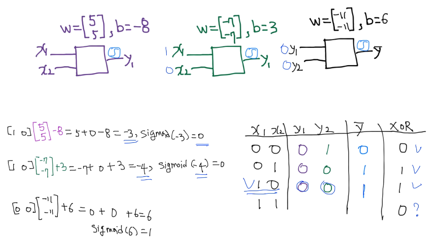
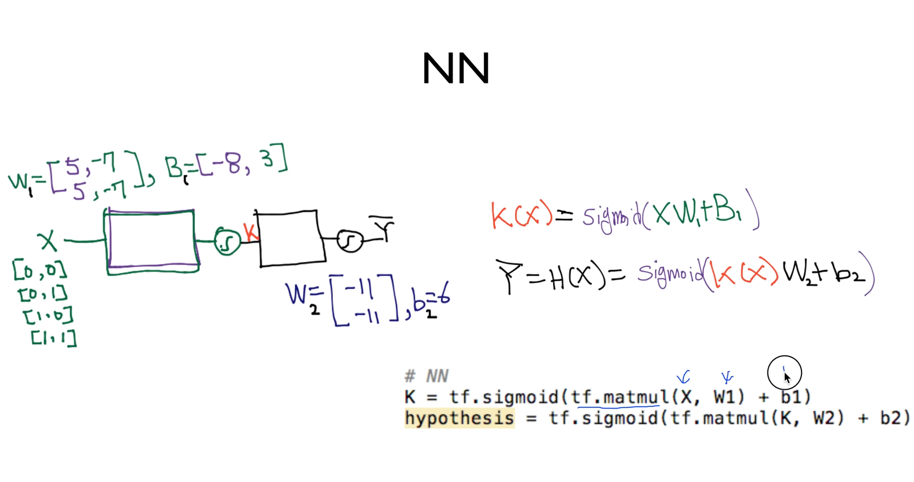
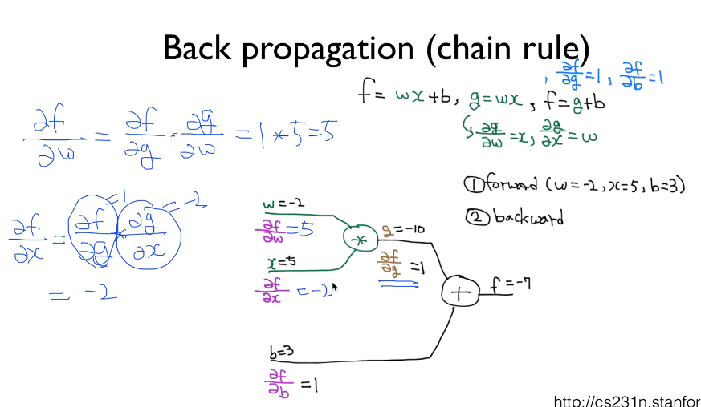
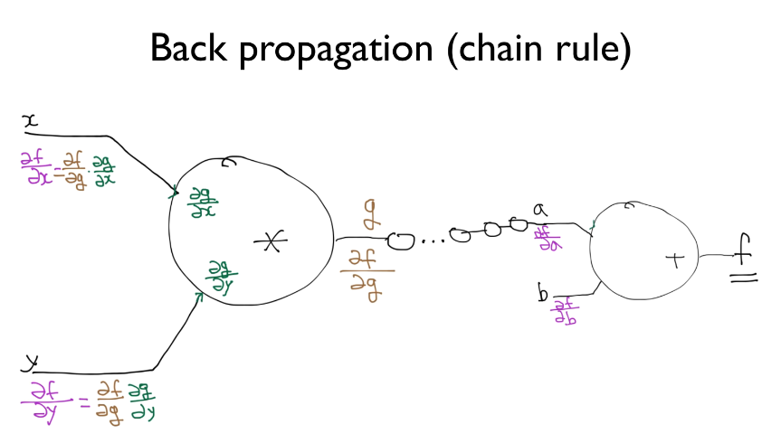

## ML lec9-1: XOR 문제 딥러닝으로 풀기
[https://youtu.be/GYecDQQwTdI]

### XOR 문제 해결

    (0, 0) -> 0
    (0, 1) -> 1
    (1, 0) -> 1
    (1, 1) -> 0 
    
    하나의 Logistic Regression 으로는 해결할 수 없다. (수학적으로 증명됨)

    Multiple Logistic Regression 으로는 해결 할 수 있다.



    (x1, x2) 입력값이 들어올때 2개의 다른 Logistic Regression 에 넣어서 
    얻어낸 각각의 결과값을 (y1, y2) 라고 하고, 
    이를 다시 새로운(3rd) Logistic Regression 에 집어 넣으면 XOR 문제를 해결할 수 있다

> 앞선 강의에서 (lec6) 여러개의 Logistic Regression 으로 Multinomial Classification 을 만듬

    Multinomial Classification 의 식을 계산하기 편하게 행렬식으로 만들었었음

    이번에도 마찬가지로 여러개의 Logistic Regression 을 사용하므로 같은 방식으로 행렬식 만듬



    수식은 다음과 같음 (K = 첫 2개의 로지스틱회귀 거침)
    H(x) = sigmoid(K(x)*W2 + b2)    여기서 세번째 모델 거침

## ML lec9-2: 딥넷트웍 학습 시키기 (backpropagation)
[https://youtu.be/573EZkzfnZ0]


### BackPropagation (Chain Rule)

    네트위크를 학습 시키기위해선 GD 알고리즘등을 이용해 cost를 줄이는 방법을 택함
    앞선 식 보다 많고 복잡한 NN을 구성했다면.. 
    매 학습마다 수많은 레이어들의 미분값을 구해서 GD 알고리즘을 진행해야함 -> 불가능에 가까움

    BackPropagation 을 사용한다면 수많은 레이어에 대해서도 충분히 가능함

#### Chain Rule



    f = wx + b, g = wx , f = g + b 로 나타낼 수 있음

    이때 각각의 노드들 (x, w, b)이 f에 얼만큼의 영향을 주는지 편미분을 통해 알 수 있음

    Chain Rule 이란 f(g(x)) 와 같은 식을 df/dx = df/dg * dg/dx 로 나눠서 계산하는것

    dg/dw = x, gd/dx = w, df/dg = 1, df/db = 1 임을 알 수 있고 (f, g에서 사용되는 연산의 종류를 알기에 (+,*))

    BackPropagation 을 하기위해서 각가의 입력값이 결과에 얼마나 영향을 주는지를 알아야 하기에
    df/db, df/dw, df/dx 다음 3값을 구해야함

    df/db = 1,
    df/dw = df/dg * dg/dw = 1 * x = x,
    df/dx = df/dg * dg/dx = 1 * w = w 

    다음과 같이 위에서 구한값과 Chain Rule 을 통해서 구할 수 있음


```py
    처음 설정한 입력값이 w = -2, x = 5, b = 3 이라면, df/dw = 5, df/dx = -2, df/db = 1 이기 때문에
    f =  wx + b = -7 이라는 예측값(H) 를 갖는다 만약 해당 인풋의 정답이 -12 라면, 
    우리는 w 가 5만큼의 영향이 있다는걸 df/dw = 5 에서 알 수 있으므로 w를 -1 조정하여 f = -12 정답을 만족시킴
```



    아무리 깊은(많은) 레이어도 다음과 같은 연쇠법으로 미분값을 구할 수 있음
