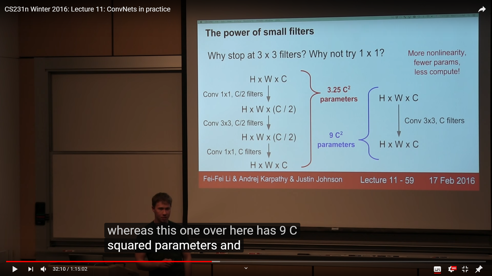

## Q:soft max 적용

    Softmax 함수는 logits(hypothesis)에 적용하지 않고(tf.nn.softmax())
    cost function 에만 적용하는게 맞는가?
    (cost = tf.reduce_mean(tf.nn.softmax_cross_entropy_with_logits(logits=hypothesis, labels=Y)))

### 예시코드

```py
# 기존의 코드 (softmax 적용..)

X = tf.placeholder("float", [None, 4])
Y = tf.placeholder("float", [None, 3])
nb_classes = 3  # 분류할 class 의 가짓수

# 4가지 feature가 들어오고 3개의 클래스로 분류하므로 shape=[4,3]
W = tf.Variable(tf.random_normal([4, nb_classes]), name='weight')
b = tf.Variable(tf.random_normal([nb_classes]), name='bias')

# tf.nn.softmax computes softmax activations
# softmax = exp(logits) / reduce_sum(exp(logits), dim)
hypothesis = tf.nn.softmax(tf.matmul(X, W) + b) # softmax 함수를 적용한 H

# Cross entropy cost/loss
cost = tf.reduce_mean(-tf.reduce_sum(Y * tf.log(hypothesis), axis=1))   # Cross entropy
# GD 를 이용하여 학습
optimizer = tf.train.GradientDescentOptimizer(learning_rate=0.1).minimize(cost)

```

```py
# ReLU를 이용한 코드... softmax 미적용

# input place holders
X = tf.placeholder(tf.float32, [None, 784])
Y = tf.placeholder(tf.float32, [None, 10])

# weights & bias for nn layers
W1 = tf.Variable(tf.random_normal([784, 256]))
b1 = tf.Variable(tf.random_normal([256]))
L1 = tf.nn.relu(tf.matmul(X, W1) + b1)

W2 = tf.Variable(tf.random_normal([256, 256]))
b2 = tf.Variable(tf.random_normal([256]))
L2 = tf.nn.relu(tf.matmul(L1, W2) + b2)

W3 = tf.Variable(tf.random_normal([256, 10]))
b3 = tf.Variable(tf.random_normal([10]))
logits = tf.matmul(L2, W3) + b3

# define cost/loss & optimizer
cost = tf.reduce_mean(tf.nn.softmax_cross_entropy_with_logits(
    logits=logits, labels=Y))
optimizer = tf.train.AdamOptimizer(learning_rate=learning_rate).minimize(cost)

```

## A: softmax_cross_entropy_with_logits 을 사용하면 softmax가 적용되는것과 같다
    
    인자로 softmax가 적용되기전의 logits을 요구하기 때문
```py
    logits = tf.matmul(L2, W3) + b3
    # ogits = 예측값 (softmax를 거치기전의 Hypothesis)
    cost = tf.reduce_mean(tf.nn.softmax_cross_entropy_with_logits(logits=logits, labels=Y))
```
    결국 마지막 노드인 optimizer를 학습시킬때에는 Hypothesis가 아닌 cost를 사용하므로
    (cost는 Hypothesis와 연결되어있음)
    cost 를 softmax_cross_entropy_with_logits 으로 적용하려면 softmax를 거치지 않은 logits 를 넣어줌
    (cost와 Hypothesis가 아닌 logits과 연결)

    결국 같은거임
    softmax_cross_entropy_with_logits 을 사용하지 않고 수식으로 구현한다면,

    hypothesis = tf.nn.softmax(tf.matmul(X, W) + b)
    cost = tf.reduce_mean(-tf.reduce_sum(Y * tf.log(hypothesis), axis=1))

    같이 구현해야 할것 (logits에 softmax를 적용한 hypothesis)

## CNN 에서 필터의 크기

    필터의 크기를 5x5, 7x7로 하는 것보다, 3x3 필터를 여러개 사용하는것이 계산량이 적음

    그렇다면 가장빠른 1x1 필터를 사용하지 않는이유는?
    
    [https://iamaaditya.github.io/2016/03/one-by-one-convolution/]



    CS231n [https://youtu.be/pA4BsUK3oP4?t=1974]

    Most simplistic explanation would be that 1x1 convolution leads to dimension reductionality. 
    For example, an image of 200 x 200 with 50 features on convolution with 20 filters of 1x1 would
    result in size of 200 x 200 x 20. But then again, is this is the best way to do dimensionality
    reduction in the convoluational neural network? What about the efficacy vs efficiency?

    1x1 필터는 인풋 이미지의 픽셀을 크기 그대로 옮기지만, 각 픽셀의 feature를 1개로 줄이기때문에
    200x200x50 의 인풋이 20개의 1x1 필터를 지나면, 200x200x20 의 정보만 남게됨..
    이것은 차원을 줄이기 때문에 정보의 손실이 있음


## 다시 생각해보는 Logistic Regression 과 Linear Regression

    [http://gnujoow.github.io/ml/2016/01/29/ML3-Logistic-Regression/]
    
    선형회귀 모델은 여러 데이터들을 선으로 구분짓는 방법

    H(x) = W x + b 꼴의 가설함수로 나타냄 (당연히 값이 0보다 작을수도, 1보다 클수도 있음)

    분류(Classification) 을 위해서는 2가지 중 하나로 나타내야함

    로지스틱 회귀는 H(x) = W x + b 의 값을 0~1 사이로 정규화해 가설함수로 사용
    (시그모이드를 적용하면 간단함) 0.5 보다크면 True, 작으면 false 로 분류가능

    cost 함수를 Linear Regression 처럼 오차의제곱평균으로 설정하면,
    시그모이드가 추가되면서 울퉁불퉁한 형태의 그래프가 생성됨
    -> 별도의 cost 함수 필요
    -> lec 5 참조


    이후 여러가지의 라벨로 분류하는 문제는 Logistic Regression을 여러번 사용할 수 있지만
    Softmax 기법으로 처리함
### Softmax
    softmax 회귀란 기존의 logistic 회귀와 다르게
    sigmoid 함수를 통해 0~1 사이의 값을 도출하고 이를 분류하는것이 아니라

    softmax 함수를 통해 여러개의 *확률값* 을 도출한다. (sum up to 1)
    그 후에 가장 높은 확률값을 가지는 라벨을 선택하는것이 softwmax regression 이다.

### Key Differences Between Linear and Logistic Regression
    1. The Linear regression models data using continuous numeric value. 
        As against, logistic regression models the data in the binary values.

    2. Linear regression requires to establish the linear relationship among dependent and independent variable 
        whereas it is not necessary for logistic regression.

    3. In the linear regression, the independent variable can be correlated with each other. 
        On the contrary, in the logistic regression, the variable must not be correlated with each other.

